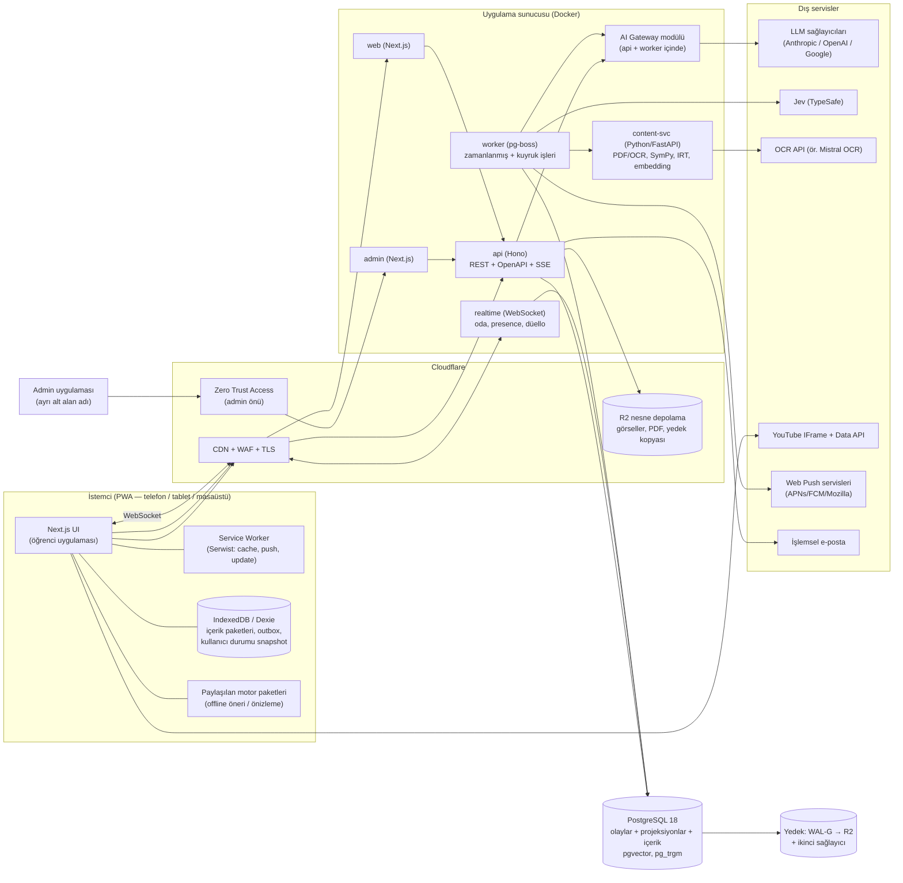

# KPSS Çalışma Platformu — Teknik Altyapı Önerisi

> **Durum:** 🟨 Tartışma taslağı (DISCUSSION_ROADMAP.md → 21. Teknik Altyapı).
> Bu belgedeki hiçbir madde henüz "kararlaştırıldı" değildir. Kabul edilen maddeler, mevcut çalışma prensibine uygun olarak `PRODUCT_PLAN.md` içine işlenecektir.
>
> **Hazırlanma tarihi:** Ekim 2026. Fiyatlar, model adları ve sürümler bu tarihteki araştırmaya dayanır; sağlayıcılar fiyatları sık değiştirdiği için uygulama anında yeniden doğrulanmalıdır (bkz. §23 Kaynaklar).
>
> **Kapsam ilkesi:** PRODUCT_PLAN §35 gereği bu belgede "MVP / ilk sürüm / sonra ekleriz" dili kullanılmaz. §20'deki **İnşa Sırası** yalnızca teknik bağımlılık sırasıdır; kabul edilen tüm sistemler tek kapsamlı çıkışın parçasıdır.

---

## İçindekiler

0. [Yönetici Özeti](#0-yönetici-özeti)
1. [Belgelerin Analizi](#1-belgelerin-analizi)
2. [Mimari İlkeler](#2-mimari-ilkeler)
3. [Ölçek ve Kapasite Varsayımları](#3-ölçek-ve-kapasite-varsayımları)
4. [Üst Düzey Mimari](#4-üst-düzey-mimari)
5. [Teknoloji Yığını](#5-teknoloji-yığını)
6. [Backend Mimarisi](#6-backend-mimarisi)
7. [Veritabanı](#7-veritabanı)
8. [Offline-First ve Cihazlar Arası Senkronizasyon](#8-offline-first-ve-cihazlar-arası-senkronizasyon)
9. [Kimlik Doğrulama ve Yetkilendirme](#9-kimlik-doğrulama-auth-ve-yetkilendirme)
10. [AI Servisleri](#10-ai-servisleri)
11. [Frontend ve PWA](#11-frontend-ve-pwa)
12. [Hosting ve Altyapı](#12-hosting-ve-altyapı)
13. [Yedekleme ve Felaket Kurtarma](#13-yedekleme-ve-felaket-kurtarma)
14. [Performans](#14-performans)
15. [Güvenlik](#15-güvenlik)
16. [Gözlemlenebilirlik ve Operasyon](#16-gözlemlenebilirlik-ve-operasyon)
17. [Test ve Kalite Stratejisi](#17-test-ve-kalite-stratejisi)
18. [Repo, Geliştirme Ortamı ve CI/CD](#18-repo-geliştirme-ortamı-ve-cicd)
19. [Maliyet Tahmini](#19-maliyet-tahmini)
20. [İnşa Sırası](#20-i̇nşa-sırası-bağımlılık-sırası-sürüm-planı-değildir)
21. [Riskler ve Azaltımlar](#21-riskler-ve-azaltımlar)
22. [Karar Bekleyen Sorular](#22-karar-bekleyen-sorular)
23. [Kaynaklar](#23-kaynaklar)

---

## 0. Yönetici Özeti

Ürün planı, sıradan bir "soru bankası sitesi" değil; **adaptif öğrenme motoru + aralıklı tekrar sistemi + içerik kalite fabrikası + oyunlaştırma/meta oyun + sosyal/realtime katman + offline-first PWA + tam yetkili operasyon merkezi** birleşimidir. Bu ölçekte bir ürünün teknik altyapısını belirleyen asıl etken kullanıcı sayısı değil, **doğruluk, izlenebilirlik ve geri alınabilirlik** gereksinimleridir (Impact Repair, recalculation, versioned config, audit, sandbox simülasyonu, offline olay senkronu).

Bu nedenle önerilen mimarinin omurgası şudur:

> **"Olay günlüğü (event log) gerçeğin tek kaynağıdır; tüm akademik ve oyunlaştırma durumları bu olaylardan, versiyonlu konfigürasyonla, deterministik motorlar tarafından türetilir."**

Bu tek karar; offline senkron, Impact Repair, Event Explorer, simülasyon, anti-farm, XP geçmişi, cihazlar arası devam ve config geri alma gereksinimlerinin hepsini aynı mekanizmayla çözer.

### Önerilen ana kararlar (özet tablo)

| # | Alan | Öneri | Kısa gerekçe |
|---|---|---|---|
| 1 | Mimari stil | **Modüler monolit** (tek repo, net modül sınırları) + küçük yardımcı servisler (worker, realtime, Python içerik servisi) | Tek geliştirici/küçük ekip için operasyon yükü minimum; modül sınırları ileride ayrıştırmaya izin verir |
| 2 | Dil | **TypeScript** (frontend + backend + motorlar) + **Python adası** (PDF/OCR, SymPy, istatistiksel kalibrasyon, embedding) | Motor kodu tarayıcıda ve sunucuda **aynı** çalışır (offline öneri); Python yalnız gerçekten üstün olduğu işlerde |
| 3 | Veritabanı | **PostgreSQL 18** + `pgvector`, `pg_trgm`, `unaccent`, ICU `tr-TR` collation | İlişkisel bütünlük + JSONB + vektör + tam metin arama tek motorda; UUIDv7 yerleşik |
| 4 | Veri modeli | **Olay günlüğü + projeksiyonlar** ("event sourcing lite"), her şey versiyonlu | Impact Repair, replay, simülasyon, offline senkron, audit |
| 5 | Backend | **Hono** (Node 24 LTS) üzerinde REST + OpenAPI + Zod; **pg-boss** (Postgres tabanlı iş kuyruğu) | Ek Redis/RabbitMQ zorunluluğu yok; tipli sözleşme; hafif |
| 6 | Frontend | **Next.js 16** (React 19.2) + Tailwind v4 + shadcn/ui; **Serwist** service worker; **Dexie (IndexedDB)** offline depo; **KaTeX** matematik | PWA + offline + SSR'lı hızlı ilk açılış; olgun ekosistem |
| 7 | Auth | **Better Auth** (kendi Postgres'imizde): e-posta+şifre, Google, passkey, TOTP 2FA; adminde 2FA/passkey **zorunlu** | Kullanıcı başı ücret yok, veri bizde, eklenti tabanlı |
| 8 | AI | Kendi **AI Gateway** katmanımız: sağlayıcı adapter'ları + görev→seviye→model eşleme tablosu + prompt registry + bağlam montajı + maliyet sayacı; kullanıcı anahtarları **zarf şifreleme** ile | Sağlayıcıdan bağımsızlık, BYOK güvenliği, admin panelinden değiştirilebilir eşleme |
| 9 | Hosting | **Cloudflare (DNS/CDN/WAF/R2)** önünde, **Hetzner Cloud** üzerinde Docker konteynerleri (Kamal 2 veya Coolify ile deploy); ayrı **staging** | Aylık maliyet düşük, tam kontrol, vendor lock-in yok; alternatif yönetilen seçenek §12'de |
| 10 | Yedekleme | **WAL-G ile sürekli WAL arşivi (PITR, RPO ≤ 5 dk)** + günlük tam yedek + haftalık mantıksal dump **ikinci bir sağlayıcıya** + aylık otomatik geri yükleme tatbikatı | 3-2-1 kuralı; yedeğin varlığı değil **geri yüklenebilirliği** test edilir |
| 11 | Tekrar motoru | **FSRS** (açık kaynak, kişiselleştirilebilir aralıklı tekrar algoritması) kazanım/konu düzeyine uyarlanır | Plan §17'deki "sabit 1-3-7-14 değil, kişiye göre öğrenen hafıza dayanıklılığı" ilkesinin hazır, kanıtlanmış karşılığı |
| 12 | Zorluk kalibrasyonu | Ürün kuralları (+5/−5…) aynen korunur; **soru zorluğu** gece çalışan **IRT/Elo tabanlı toplu kalibrasyon** ile veriden öğrenilir | Plan §7'de "henüz tamamlanmamış" denen soru zorluk hesabının somut önerisi |

### Araştırmada ortaya çıkan ve plana doğrudan etki eden 5 kritik bulgu

1. **Jev (TypeSafe AI) metin-only, en iyi İngilizce çalışıyor ve sayma/matematik/tarih sıralamada güvenilmez olduğunu kendisi beyan ediyor.** Türkçe KPSS sorularında doğruluğu **ölçülmeden** ana sınıflandırıcı kabul edilmemeli → §10.8'de "altın veri seti + kalibrasyon kapısı + LLM yedek sınıflandırıcı" tasarımı.
2. **YouTube'un resmî API'si başkasına ait videoların altyazısını indirmeye izin vermiyor** (caption indirme yalnız video sahibinin OAuth yetkisiyle). Plan §22'deki "mümkünse transcript" maddesi scraping gerektirir ve ToS riski taşır → §10.12'de admin destekli **bölüm özeti** yaklaşımı önerildi.
3. **iOS'ta web push yalnızca ana ekrana eklenmiş PWA'da çalışıyor** (iOS 16.4+). AB'deki DMA kısıtı Türkiye'yi etkilemiyor; ama "bildirim izni" akışı iOS'ta "önce ana ekrana ekle" adımını içermeli.
4. **Hetzner 2026'da fiyatlarını birkaç kez artırdı** (paylaşımlı ARM/Intel hatlarında ~%30–40, ayrılmış vCPU hatlarında %170'e kadar). Ucuz VPS hâlâ en ekonomik seçenek, ancak mimarinin **sağlayıcı değiştirebilir** (Docker + standart Postgres + S3 uyumlu depolama) kalması şart.
5. **KVKK (2024 değişikliği)**: 1 Eylül 2024'ten itibaren yurt dışı aktarım açık rızaya dayandırılamıyor; yeterlilik kararı yoksa **standart sözleşme + 5 iş günü içinde Kurul'a bildirim** gerekiyor. Planda KVKK hiç geçmiyor → §12.5'te veri konumu kararı olarak gündeme alındı.

---

## 1. Belgelerin Analizi

### 1.1 Ürünün teknik açıdan özeti

İki belge birlikte okunduğunda ürün şu **alt sistemlerden** oluşuyor (parantez içi PRODUCT_PLAN bölüm numaraları):

| Katman | Alt sistemler |
|---|---|
| **Akademik çekirdek** | Konu bazlı gizli seviye 0–110 (§4), hızlı kalibrasyon +5/+3/+2/+1 (§5), seviye güveni (§6), soru zorluğu (§7, §9), program motoru (§13), 10 soruluk test (§14), soru bankası (§15), konu öğrenme + YouTube (§12, §16), tekrar/unutma (§17), yanlış sistemi (§18), denemeler + Gerçek Sınav Modu (§19), istatistik (§20), hedef puan + readiness (§21) |
| **AI katmanı (opsiyonel)** | AI Öğretmen (§22), AI Koç (§23), BYOK + 4 kalite seviyesi + AI'sız çalışma (§24), Jev sınıflandırma (§8, §39), AI çözüm üretimi + doğrulama zinciri (§15, §41) |
| **Oyunlaştırma** | XP/Level (§25), Streak (§26), Başarımlar (§27), Görevler (§28), Kamplar (§29), Oturum sonu sunumu (§30), Kozmetikler (§31), Yolculuk Haritası (§32), Özel Anlar (§33) |
| **Meta + Sosyal** | Sezonlar, Sezon Yolu, Ligler, Rekorlar, Etkinlikler, Topluluk hedefleri (§34); Arkadaşlık, Birlikte Çalış odaları, meydan okuma, **canlı 1v1 düello**, ekipler, takım ligi, mesajlaşma, moderasyon (§36) |
| **Platform** | Onboarding + Demo (§37), Mobil/PWA + offline + cihazlar arası devam + push (§38) |
| **Operasyon** | PDF/Kitap import + OCR + Jev (§39), Admin Control Center: RBAC, audit, versioned config, feature flags, sandbox/simülasyon, Event Explorer, jobs, anti-farm, moderasyon, analytics (§40), İçerik Kalite Kontrolü: provenance, quality gate, quarantine, Impact Repair, coverage (§41) |

Kabaca **40+ alt sistem**, **~60–80 veri varlığı (entity)** ve **~40 arka plan iş türü** anlamına geliyor. Bu, tek bir kişinin "hafta sonu projesi" ölçeğinin çok üstünde; mimari kararların birinci hedefi **karmaşıklığı tek bir tutarlı modele indirgemek** olmalıdır (bkz. §2).

### 1.2 Belgelerden çıkarılan teknik gereksinimler

Aşağıdaki tablo, ürün kararlarının teknik karşılıklarını gösterir. Bu tablo, altyapı seçimlerinin "neden" sorusunun cevabıdır.

| Ürün kararı (kaynak) | Teknik sonuç |
|---|---|
| Test sırasında cevaplar değiştirilebilir; seviye yalnız **Testi Bitir**'de toplu güncellenir (§5, §14) | Test oturumu = taslak durum; bitirişte **tek atomik işlem** (transaction) ile puanlama + olay yazımı; idempotent submit |
| Test, **başlangıçtaki** seviyeye göre hazırlanır; admin değişikliği oturumu bozmaz (§14, §41) | Test oluşturulurken **question_version snapshot** sabitlenir; testler versiyon ID'leri üzerinden çalışır |
| İlk 30 **benzersiz** soru kalibrasyonu (§5) | Kullanıcı–soru ilişki tablosu (`user_question_stats`) + benzersizlik sayacı konu bazında |
| Geçiş eşiği kişisel: doğrulanmış başlangıç + ~20, önkoşul yeterliliği (§13) | Konu bazında `verified_baseline` alanı; **önkoşul DAG**'ı (döngü kontrolü) ve kenar başına minimum yeterlilik |
| Program motoru: ders değeri, ilerleme, öğrenme zinciri, ihmal bonusu, zaman baskısı, hedef sinyali (§13, §21) | Deterministik, açıklanabilir puanlama hattı; her öneri "Neden?" için **yapılandırılmış gerekçe** üretir |
| Kişiselleşen tekrar aralıkları; ham retention gösterilmez (§17) | Kazanım/konu düzeyinde hafıza modeli (FSRS önerisi); 3 durumlu kullanıcı etiketi |
| En az 2 yeni doğrulama sorusuyla yanlışın kapanması (§18) | Yanlış yaşam döngüsü durum makinesi + kazanım bazlı soru seçimi |
| Gerçek Sınav Modu: süre durdurulamaz, app kapanınca bile işler (§19, §38) | **Sunucu otoriteli zaman** (başlangıç anı sunucuda), istemci saatine güvenilmez |
| Hatalı soru düzeltilince geçmiş mastery/retention/deneme onarılır; XP/başarım geri alınmaz (§41) | Olaylardan **yeniden hesaplama (replay)** + akademik/oyun projeksiyonlarının farklı onarım politikaları |
| Config versiyonlu, taslak→önizleme→yayın, geri alma, simülasyon (§40) | `config_set` sürüm tablosu; her olay hangi config sürümüyle işlendiğini taşır; motorlar saf fonksiyon |
| Event Explorer: TEST_STARTED, ANSWER_SELECTED, XP_GRANTED … (§40) | Olay şeması kataloğu; olay tablosu zaman serisi olarak bölümlenmiş (partitioned) |
| Offline test, not, yanlış inceleme; bağlantı gelince güvenli senkron (§38) | İstemcide **olay outbox**'ı + idempotency; içerik paketleri; çakışma politikaları |
| Telefonda başla, bilgisayarda devam et (§38) | Sunucuda aktif çalışma durumu ("resume pointer"); test için **aktif cihaz kilidi (lease)** |
| Canlı 1v1 düello, çalışma odaları, presence (§36) | WebSocket tabanlı **realtime servis**, sunucu otoriteli düello durum makinesi |
| Bildirim kategorileri, deep-link, Gerçek Sınav Modunda susturma (§36, §38) | Web Push (VAPID) + bildirim tercih tablosu + "sessiz mod" durumu sunucuda |
| AI'sız tam çalışma; AI hatası çekirdeği bozmaz (§24) | AI çağrıları **hiçbir zaman** çekirdek işlem transaction'ı içinde değil; AI = asenkron/yan katman |
| Kullanıcı kendi API anahtarı; admin bile göremez (§24, §40) | Zarf şifreleme (envelope encryption), anahtar asla istemciye geri dönmez, loglardan maskelenir |
| Jev sınıflandırması taxonomy ID'lerine bağlı, alan başına güven (§39) | Kısıtlı seçim kümeleriyle hiyerarşik sınıflandırma; güven eşikleriyle otomatik kabul/inceleme |
| Üretici AI → bağımsız doğrulayıcı → kod/simgesel kontrol → karantina (§15, §41) | Çok sağlayıcılı doğrulama hattı + **SymPy** doğrulama servisi |
| PDF'den native soru; matematik yapılandırılmış; yalnız gerçek görseller kırpılır (§39) | Layout+OCR+VLM hattı; LaTeX matematik; görsel bölge kırpma; kaynak bölge provenance'ı |
| Duplicate/near-duplicate, fake diversity tespiti (§39, §41) | Embedding (pgvector) + MinHash/shingle benzerliği |
| Anti-farm sessiz ve görünmez (§25) | Aktif süre ölçümü (heartbeat), sunucu tarafı XP hesabı, anomali kuralları |
| Takvim günü kullanıcının saat dilimine göre; gece yarısı adaleti (§26, §28) | Kullanıcı saat dilimi + "çalışma günü sınırı" kuralı (öneri §7.7) |
| Sandbox kullanıcıları gerçek analytics/leaderboard'a karışmaz (§40) | Hesap türü (`real`/`test`/`demo`) tüm toplama sorgularında filtre |
| Çok yıllı KPSS dönem arşivi (§34) | `exam_period` kavramı; akademik veriler döneme bağlı, kalıcı hesap verisi dönemden bağımsız |

### 1.3 Belgelerdeki tutarsızlıklar ve eskimiş ifadeler

Analiz sırasında, ürün kararlarını değiştirmeyen ama teknik uygulama öncesi temizlenmesi gereken noktalar bulundu. **Bu belgede bunlar düzeltilmedi**; yalnızca raporlanıyor:

| # | Konum | Sorun | Öneri |
|---|---|---|---|
| T1 | PRODUCT_PLAN §14 vs §38 | §14: "Özel klavye kısayolları … planın temel parçası olmayacaktır." §38: "Masaüstü … **klavye kısayolları** gibi avantajlar kullanılacaktır." | Hangisinin geçerli olduğu netleştirilmeli (öneri: temel erişilebilirlik için klavye navigasyonu zorunlu, özel kısayol seti opsiyonel) |
| T2 | §3 vs §37 | §3: Ders bazında seviye **zorunlu** başlangıç bilgisi. §37: zorunlu çekirdek "hesap + KPSS türü/dönemi + minimum başlangıç akademik profili"; kalibrasyon atlanabilir | §3 güncellenmeli (§37 daha yeni ve ayrıntılı) |
| T3 | §3 | "Hedef puan … ileride değerlendirilebilir; henüz kesin değildir." | §21 ve §37 bunu kararlaştırdı; §3 eskimiş |
| T4 | §11, §12 başlıkları | "kısmen kararlaştırıldı" yazıyor; yol haritasında ✅ | Başlıklar güncellenmeli |
| T5 | §23 | "Oyunlaştırma … henüz kararlaştırılmadığı için" ve "entegrasyon ayrıca yapılabilir" | Oyunlaştırma tamamlandı; AI Koç ↔ oyunlaştırma entegrasyonu hiç tekrar ele alınmadı (açık uç) |
| T6 | §25, §31, §34 | "İlk sürüm için 1–100", "İlk sürümde coin/mağaza yok", "İlk sürüm avatar sistemi basit" | §35 "ilk sürüm" dilini yasaklıyor; ifadeler "çıkış kapsamında" olarak düzeltilmeli |
| T7 | §26 | "Bildirim gönderilip gönderilmeyeceği ayrıca bildirim başlığında kararlaştırılacaktır." | Yol haritasında ayrı bildirim başlığı yok; §36 ve §38 kısmen kapsıyor. Streak hatırlatma bildirimi kararı açık |
| T8 | §36 | "Tam DM sistemi **kullanılacaksa** …" | DM var mı yok mu kararı verilmemiş; moderasyon, depolama ve güvenlik kapsamını doğrudan etkiliyor (bkz. §22 soru listesi) |
| T9 | §42 | "Henüz planlanacak büyük alanlar" listesi eskimiş (çoğu tamamlandı) | Liste yalnızca "Teknik mimari ve veri modeli" ve "Bildirimler" olarak güncellenmeli |
| T10 | §7 | "Soru zorluk puanının kesin hesaplama yöntemi henüz tamamlanmamıştır." | Bu belge §6.4.2'de öneri getiriyor |
| T11 | §22 | "mümkünse transcript" | Resmî API ile mümkün değil (bkz. §10.12) |
| T12 | §8, §39 | Jev'e geniş görevler atanmış (zorluk, çeldirici gücü, KPSS uygunluğu, aday seçim yardımı) | Jev'in beyan edilen sınırlarıyla uyumlu değil (bkz. §10.8) |

### 1.4 Belgelerde ele alınmamış ama altyapının çözmesi gereken boşluklar

1. **Ölçek varsayımı yok.** "Kişisel kullanım ve arkadaşlar" (§1) deniyor ama lig, takım ligi, topluluk hedefleri ve global nadirlik istatistikleri (§27) belirli bir kullanıcı kitlesi varsayıyor. Kapasite planlaması için hedef aralık gerekiyor (§3'te varsayım önerildi).
2. **Platformun kendi AI maliyeti.** BYOK yalnızca kullanıcıların AI kullanımını kapsıyor. Oysa **içerik hattı** (çözüm üretimi, doğrulama, Jev, PDF/OCR, özet taslakları, embedding) platform sahibinin kendi anahtarıyla çalışmak zorunda. Bu bütçe hiç konuşulmadı (§19'da tahmin var).
3. **KVKK / kişisel veri.** Aydınlatma metni, veri konumu, yurt dışı aktarım, silme/ihraç hakları, AI sağlayıcılarına giden veri. (§12.5, §15)
4. **E-posta altyapısı.** Doğrulama, şifre sıfırlama, güvenlik uyarıları için işlemsel e-posta servisi gerekli.
5. **İçerik telif durumu.** PDF/kitap içe aktarma "kaynak kullanım hakkı durumu" (§41) ile sınırlı tutulmuş; arkadaşlarla paylaşılan bir platformda bile basılı kitapların sorularını yeniden yayımlamak telif riski taşır. Teknik tarafta lisans durumu alanı ve "yalnızca izinli kaynak Active olabilir" kuralı önerilir.
6. **Hesap silme ve veri ihracı** admin panelinde var (§40) ama kullanıcı self-servis akışı ve sosyal verilerdeki etkisi (takım geçmişi, düello kayıtları) tanımsız → anonimleştirme politikası gerekli.
7. **Saat ve takvim kuralı.** "Tutarlı bir kural" denmiş, kuralın kendisi yok (öneri §7.7).
8. **İçerik hacmi hedefi.** Kaç ders × konu × kazanım × zorluk hücresinde kaç onaylı soru gerektiği (coverage hedefi) tanımlanmamış. Ürünün **kritik yolu** yazılım değil, kaliteli içerik üretimi olacaktır (bkz. §20, §21).

---

## 2. Mimari İlkeler

Bu ilkeler, belgedeki her teknik kararın dayandığı kurallardır. Kabul edilirse PRODUCT_PLAN'a "Teknik ilkeler" olarak işlenebilir.

1. **Olay günlüğü gerçeğin kaynağıdır.** Kullanıcının yaptığı her anlamlı şey değiştirilemez bir olay olarak yazılır. Gizli seviye, retention, XP, streak, başarım, sezon puanı gibi tüm durumlar bu olaylardan türetilmiş **projeksiyonlardır**. Bir projeksiyon bozulursa olaylardan yeniden üretilir.
2. **Deterministik çekirdek, AI kenarda.** Akademik ve oyun kuralları saf (side-effect'siz) TypeScript fonksiyonlarıdır: `(mevcut durum, olay, config sürümü) → (yeni durum, türetilmiş olaylar)`. AI hiçbir zaman bu fonksiyonların içinde değildir (Plan §8 ve §24 ile birebir uyumlu).
3. **Her şey versiyonludur.** Soru, çözüm, taxonomy, config, prompt, kozmetik kataloğu, sezon tanımı. "Hangi kullanıcı hangi sürümü gördü/çözdü/hangi kurallarla puanlandı" her zaman cevaplanabilir.
4. **İstemci iddia eder, sunucu karar verir.** İstemci "şu soruya B dedim, şu kadar sürede" der; doğruluk, puan, XP ve sezon puanı **sunucuda** hesaplanır. Offline'da istemci aynı motorla önizleme gösterebilir, kalıcı sonuç sunucudandır.
5. **Offline yazma = olay kuyruğu.** Offline'da CRUD senkronu değil, olay outbox'ı kullanılır. Olaylar ekleme-only olduğu için çakışma sınıfı dramatik biçimde küçülür.
6. **Tek dil, tek tip sistem.** TypeScript ile şema (Zod) bir kez yazılır; API sözleşmesi, form doğrulama, olay şeması ve veritabanı tipi aynı kaynaktan türetilir. Python yalnızca ayrı bir "içerik/istatistik adası" olarak, iç ağdan HTTP ile çağrılır.
7. **Taşınabilirlik.** Standart Postgres, S3 uyumlu depolama, Docker konteynerleri, OpenTelemetry. Hiçbir çekirdek özellik tek bir bulut sağlayıcısının tescilli API'sine bağlanmaz.
8. **Operasyon bütçesi tek kişiliktir.** Her bileşen "bunu 3 ayda bir 1 saat bakımla ayakta tutabilir miyim?" testinden geçer. Kuyruk için ayrı broker yerine Postgres; arama için ayrı motor yerine Postgres FTS.
9. **Güvenli varsayılanlar.** Gizlilik varsayılan kapalı, admin işlemleri varsayılan denetimli, sırlar varsayılan şifreli, loglar varsayılan maskeli.
10. **Gözlemlenebilir doğruluk.** Her motor kararı (öneri, XP, seviye değişimi) açıklanabilir bir gerekçe kaydı üretir; "Neden?" ekranları ve admin Event Explorer bu kayıtlardan beslenir.

---

## 3. Ölçek ve Kapasite Varsayımları

Kullanıcı sayısı belirsiz olduğu için üç senaryo tanımlandı. **Tasarım hedefi: Senaryo B'de rahat çalışmak, Senaryo C'ye yeniden tasarım olmadan (yalnız dikey/yatay büyütmeyle) çıkabilmek.**

| Metrik | A — Çekirdek grup | B — Geniş çevre (tasarım hedefi) | C — Büyüme tavanı |
|---|---:|---:|---:|
| Kayıtlı kullanıcı | ~20 | ~500 | ~5.000 |
| Günlük aktif | ~10 | ~150 | ~1.500 |
| Eşzamanlı (zirve) | ~5 | ~50 | ~400 |
| Günlük cevap olayı | ~2.000 | ~40.000 | ~400.000 |
| Yıllık olay satırı (tüm türler) | ~2 M | ~40 M | ~400 M |
| Soru bankası (versiyonlarla) | 10–50 bin soru, ~100–300 MB |
| Görseller (soru + kozmetik) | ~2–10 GB (CDN üzerinden) |
| Veritabanı boyutu (1 yıl) | < 2 GB | ~10–25 GB | ~100–200 GB |

Çıkarımlar:
- **Senaryo B için tek bir orta boy sunucu fazlasıyla yeterli.** Darboğaz donanım değil; sorgu tasarımı ve indekslerdir.
- Olay tablosu Senaryo C'de 400 M satıra ulaşır → **ilk günden aylık partitioning** (bölümleme) ve sıcak/soğuk veri ayrımı.
- Realtime (düello/oda) eşzamanlılığı düşük; tek realtime süreci Senaryo C'ye kadar yeter.

---

## 4. Üst Düzey Mimari



### 4.1 Neden modüler monolit?

| Seçenek | Artı | Eksi | Karar |
|---|---|---|---|
| **Mikroservisler** | Bağımsız ölçekleme/deploy | Dağıtık transaction, ağ hataları, çoklu repo/deploy, gözlemlenebilirlik maliyeti; tek kişi için yönetilemez | ❌ |
| **Tek yapı (spagetti monolit)** | En hızlı başlangıç | 40+ alt sistemde kısa sürede çözülemez bağımlılık ağı | ❌ |
| **Modüler monolit + 3 yardımcı süreç** | Tek veritabanı transaction'ı, tek deploy hattı, net modül sınırları, gerektiğinde ayrıştırılabilir | Modül sınırlarını disiplinle korumak gerekir (lint kuralı ile zorlanır) | ✅ |

Yardımcı süreçler yalnızca **çalışma zamanı karakteri farklı** olduğu için ayrılır:
- **realtime**: uzun ömürlü WebSocket bağlantıları,
- **worker**: uzun süren/zamanlanmış işler (API yanıt sürelerini etkilememeli),
- **content-svc (Python)**: Python ekosistemine özgü kütüphaneler (PyMuPDF, SymPy, istatistik).

Hepsi **aynı monorepo**'da, aynı paylaşılan paketleri (şema, motorlar) kullanır.

---

## 5. Teknoloji Yığını

| Katman | Seçim | Alternatif(ler) | Gerekçe |
|---|---|---|---|
| Dil | TypeScript 5.x (strict) | — | Uçtan uca tip güvenliği; motorların istemci+sunucuda aynı çalışması |
| Çalışma zamanı | Node.js 24 LTS | Bun | LTS kararlılığı; Bun ileride değerlendirilebilir |
| Monorepo | pnpm workspaces + Turborepo | Nx | Basit, hızlı, önbellekli build |
| Öğrenci uygulaması | Next.js 16 (App Router, React 19.2) | Vite + React SPA + TanStack Router | SSR ile hızlı ilk açılış, RSC ile küçük JS; PWA desteği; olgun ekosistem |
| Admin uygulaması | Next.js 16 (ayrı uygulama, ayrı alt alan adı) | Refine / React-Admin | Aynı bileşen kütüphanesi; güvenlik izolasyonu |
| UI | Tailwind CSS v4 + shadcn/ui (Radix) | Mantine, Chakra | Erişilebilir primitive'ler, tam görsel kontrol (premium tasarım hedefi) |
| Animasyon | Motion (framer-motion) | CSS-only | `prefers-reduced-motion` ve "Tam/Azaltılmış/Kapalı" tercihi (§30) |
| Sunucu durumu | TanStack Query | SWR | Önbellek, offline mutation kuyruğu, yeniden deneme |
| Yerel durum | Zustand | Jotai | Hafif |
| Offline depo | Dexie (IndexedDB) | OPFS + SQLite WASM, PowerSync | Olgun, tüm tarayıcılarda; liveQuery ile reaktif |
| Service worker | Serwist | Workbox doğrudan | next-pwa'nın modern halefi; precache + runtime cache + push |
| Matematik gösterimi | KaTeX | MathJax | Çok hızlı, SSR uyumlu |
| Zengin içerik editörü (admin) | TipTap (ProseMirror) + matematik/görsel/öncül düğümleri | Lexical | Yapılandırılmış JSON çıktısı → öğrenci tarafında aynı renderer |
| Grafikler | Recharts (standart) + özel SVG (Yolculuk Haritası) | ECharts, visx | Dokunmatik tooltip, hafif |
| API sunucusu | Hono + `@hono/zod-openapi` | Fastify, tRPC, NestJS | Hafif, hızlı, OpenAPI şeması otomatik; tip güvenli istemci üretimi |
| Doğrulama | Zod | Valibot | Şema tek kaynak: API, form, olay, config |
| ORM / SQL | Drizzle ORM + drizzle-kit migration | Kysely, Prisma | SQL'e yakın, tip güvenli, hafif; ham SQL gerektiğinde engel değil |
| Veritabanı | PostgreSQL 18 | — | §7 |
| İş kuyruğu | pg-boss (Postgres tabanlı) | BullMQ + Valkey, Graphile Worker | Ek altyapı yok; transaction içinde iş kuyruğa alınabilir (outbox garantisi) |
| Realtime | `ws`/uWebSockets.js tabanlı Node servisi | Cloudflare Durable Objects, Centrifugo, Supabase Realtime | Sunucu otoriteli düello mantığı kendi kodumuzda; düşük eşzamanlılık |
| Önbellek / pub-sub | Başlangıçta Postgres LISTEN/NOTIFY; ölçek gerekince **Valkey** | Redis | İhtiyaç olmadan bileşen eklememe |
| Auth | Better Auth | Supabase Auth, Auth.js, Clerk | §9 |
| AI sağlayıcı katmanı | Kendi AI Gateway arayüzümüz; altında Vercel AI SDK adapter'ları | LangChain, doğrudan SDK'lar | §10 |
| Python servisi | FastAPI + PyMuPDF + SymPy + numpy/scipy + (opsiyonel) BGE-M3 | — | §10.10, §6.4 |
| Nesne depolama | Cloudflare R2 (S3 uyumlu) | Backblaze B2, Hetzner Object Storage | Çıkış (egress) ücreti yok; CDN ile entegre |
| Görsel işleme | sharp (AVIF/WebP varyantları) | imgproxy | Sunucu tarafı ön üretim |
| E-posta | Resend veya Amazon SES | Postmark | Düşük hacimde ücretsiz/çok ucuz |
| Push | Web Push (VAPID) — `web-push` | OneSignal | Üçüncü tarafa veri vermeden |
| Hata izleme | Sentry (PII temizleme açık) | GlitchTip (self-host) | Kaynak haritalı hata takibi |
| Metrik/log/iz | OpenTelemetry → Grafana Cloud (ücretsiz katman) veya self-host Grafana+Loki+Prometheus | Better Stack | Standart, sağlayıcıdan bağımsız |
| Ürün analitiği | Kendi olay tablomuz (öncelikli) + opsiyonel self-host PostHog | Plausible | Akademik olaylar zaten bizde; ek kopya gereksiz |
| Deploy | Kamal 2 (Docker) **veya** Coolify | Dokploy, Kubernetes | Sıfır kesintili deploy, tek sunucuda basit |
| IaC | OpenTofu (Hetzner + Cloudflare provider'ları) | Terraform, elle kurulum | Altyapının yeniden üretilebilirliği |
| Sır yönetimi | SOPS + age (repo içinde şifreli) veya Infisical | Doppler | Sırlar git'te açık metin olarak asla durmaz |
| Kalite araçları | Biome (lint/format) + TypeScript + Vitest + Playwright + fast-check + k6 | ESLint/Prettier, Jest, Cypress | Hızlı, tek araç seti |

---

## 6. Backend Mimarisi

### 6.1 Modüller (bounded context'ler)

Her modül kendi Postgres şemasına (schema), kendi servis katmanına ve dışarıya açtığı **açık arayüze** sahiptir. Modüller birbirinin tablolarına doğrudan yazmaz; olay veya modül arayüzü kullanır. Bu kural lint ile zorlanır (`eslint-plugin-boundaries` / dependency-cruiser).

| Modül | Sorumluluk | Plan bölümleri |
|---|---|---|
| `identity` | Hesap, oturum, cihaz, 2FA, passkey, RBAC, hesap silme/ihraç | §37, §38, §40 |
| `profile` | Görünen ad, @kullanıcıadı, KPSS türü/dönemi, saat dilimi, tercihler, gizlilik ayarları | §31, §36, §37 |
| `curriculum` | Ders→Konu→Alt konu→Kazanım ağacı, önkoşul DAG, sınav türü uygunluğu, sınav şablonları | §13, §19, §40 |
| `content` | Soru/çözüm/versiyon, öğrenme içerikleri, video kaynakları, öğretmenler, segmentler, varlıklar (görsel) | §15, §16, §39 |
| `quality` | Quality gate, kuyruklar, karantina, raporlar, provenance, coverage, review, Impact Repair | §41 |
| `ingest` | PDF/kitap import batch'leri, extraction, cevap anahtarı eşleme, Jev sınıflandırma işleri | §39 |
| `assessment` | Test/deneme oturumları, snapshot, cevaplar, submit, sonuç, Gerçek Sınav Modu saati, Karma Test | §14, §19 |
| `learning` | Öğrenme durumları, video ilerleme, anlayış kontrolü, notlar, timestamp notları | §16 |
| `mastery` | Gizli seviye, güven, doğrulanmış başlangıç, kazanım riski, yanlış yaşam döngüsü | §4–§6, §18 |
| `memory` | Retention/FSRS durumu, tekrar ihtiyacı sinyali | §17 |
| `planner` | Program motoru, öneri adayları, "Neden?" gerekçeleri, deneme önerisi | §13 |
| `goals` | Hedef puan, puan tahmini aralığı, readiness, hedef senaryoları | §21 |
| `analytics` | Kullanıcı istatistik okuma modelleri (dönem özetleri, hız, trend) | §20 |
| `ai` | AI Gateway, BYOK anahtarları, prompt registry, oturumlar (sohbetler), maliyet kayıtları | §22–§24 |
| `progression` | XP defteri, level, streak, koruma hakları, başarımlar, görevler, kamplar, özel anlar, yolculuk aşamaları, kozmetik envanteri | §25–§33 |
| `meta` | Sezonlar, sezon puanı, Sezon Yolu, ligler, rekorlar, etkinlikler, topluluk hedefleri | §34 |
| `social` | Arkadaşlık, engelleme, ekipler, odalar, meydan okumalar, düellolar, mesajlar, tebrikler, paylaşımlar | §36 |
| `notify` | Bildirim şablonları, tercihler, push abonelikleri, e-posta, uygulama içi gelen kutusu, sessiz mod | §36, §38, §40 |
| `ops` | Config sürümleri, feature flag'ler, audit log, iş merkezi, sistem sağlığı, sandbox/simülasyon, moderasyon kuyruğu, anti-farm | §40 |

### 6.2 API tasarımı

- **Stil:** Kaynak odaklı REST + komut uç noktaları (ör. `POST /v1/tests/{id}:submit`). OpenAPI 3.1 şeması Zod'dan otomatik üretilir; istemci SDK'sı bu şemadan üretilir (tip güvenli).
- **Sürümleme:** URL'de `/v1`. PWA güncellemeleri aktif oturumu bozmayacağı için (§38) eski istemci sürümleri bir süre desteklenir; `X-Client-Version` başlığı ile minimum sürüm politikası.
- **Idempotency:** Tüm yazma uç noktaları `Idempotency-Key` başlığı kabul eder (offline outbox yeniden denemeleri için zorunlu). Anahtar + sonuç 7 gün saklanır.
- **Toplu olay alımı:** `POST /v1/sync/events` — offline outbox'tan gelen olay dizisi; her olay için `accepted | duplicate | rejected(reason) | needs_review` döner.
- **Akış (streaming):** AI yanıtları **SSE** (Server-Sent Events) ile akar; mobil ağlarda WebSocket'ten daha dayanıklıdır.
- **Hata modeli:** RFC 9457 Problem Details (`type`, `title`, `detail`, `code`); kullanıcıya teknik kod değil, §38'deki sakin mesajlar gösterilir.
- **Sayfalama:** Cursor tabanlı (UUIDv7 zaman sıralı olduğu için doğal cursor).
- **Rate limit:** Kullanıcı + IP + uç nokta sınıfı bazında (auth uç noktaları sıkı, AI uç noktaları kullanıcı başı token kovası).
- **Önyükleme uç noktası:** `GET /v1/bootstrap` — oturum açılışında profil, flag'ler, aktif config sürüm kimlikleri, resume pointer, bildirim sayacı tek çağrıda.

### 6.3 Olay mimarisi ("event sourcing lite")

Tam event sourcing (her şeyi yalnızca olaydan okumak) bu ürün için gereksiz karmaşık olur. Önerilen hibrit:

- **Yazma yolu:** Komut → doğrulama → motor (saf fonksiyon) → **aynı transaction'da** (a) olay(lar) eklenir, (b) projeksiyon tabloları güncellenir, (c) gerekiyorsa kuyruk işi eklenir (pg-boss transaction içi).
- **Okuma yolu:** Projeksiyon tablolarından (hızlı, indeksli).
- **Onarım yolu:** Projeksiyon, ilgili olaylardan **yeniden oynatılarak (replay)** yeniden üretilebilir.

#### Olay zarfı (envelope)

| Alan | Açıklama |
|---|---|
| `event_id` | UUIDv7 — **istemcide üretilir** (offline'da da); idempotency anahtarı |
| `user_id`, `device_id`, `session_id` | Kim, hangi cihaz, hangi çalışma oturumu |
| `type`, `schema_version` | Ör. `assessment.test_submitted@3` |
| `occurred_at` | İstemci saatine göre (bilgi amaçlı) |
| `received_at` | Sunucu saati (otorite) |
| `source` | `online` / `offline_sync` / `system` / `admin_repair` / `sandbox` |
| `config_versions` | Bu olayı işleyen motorların config sürüm kimlikleri |
| `content_refs` | İlgili `question_version_id` listesi vb. |
| `correlation_id`, `causation_id` | Zincir izleme (bir test bitirme → XP → başarım → özel an) |
| `payload` | JSONB, tipine göre Zod şemasıyla doğrulanmış |

#### Örnek olay kataloğu (kısmi)

```
identity.account_created            learning.topic_started
learning.video_progressed           learning.learning_completed | learning.marked_known
learning.understanding_check_done   assessment.test_created (snapshot)
assessment.answer_set (taslak)      assessment.test_submitted
mastery.topic_score_updated         mastery.wrong_opened | wrong_reviewed | wrong_resolved
memory.review_scheduled             memory.review_completed
assessment.mock_started | mock_submitted | mock_expired
planner.recommendation_shown        planner.recommendation_accepted | rejected
progression.xp_granted              progression.level_up
progression.streak_day_recorded     progression.streak_protected | streak_reset
progression.achievement_unlocked    progression.quest_progressed | quest_completed
progression.camp_stage_completed    progression.special_moment_created
progression.journey_stage_reached   meta.season_points_granted
social.duel_finished                quality.question_reported
quality.question_revised(material)  quality.impact_repair_applied
ai.message_sent (yalnız meta veri)   ops.config_published
```

> Not: `assessment.answer_set` (test sırasında cevap değiştirme) ayrıntılı süre analizi için tutulur ama **seviye güncellemesine girmez**; seviye yalnız `test_submitted` ile işlenir (Plan §5, §14).

#### Onarım politikaları (Impact Repair, §41)

| Projeksiyon | Replay sonrası farklılıkta politika |
|---|---|
| Gizli seviye, güven, retention, yanlış durumu, deneme sonucu | **Yeniden hesaplanır** (doğru veri esas) |
| XP / level | Eksikse **fark verilir**, fazlaysa **geri alınmaz** (`progression.xp_compensation` olayı) |
| Başarımlar, kozmetikler, yolculuk aşaması | **Asla geri alınmaz**; eksik kalan hak edilmişse verilir |
| Sezon puanı / lig | Sezon açıksa yeniden hesaplanır; kapanmış sezon sonuçları dondurulur (adalet) |
| Kullanıcıya bildirim | Tek, sade mesaj: "Daha önce çözdüğün bir soruda hata düzeltildi; ilgili istatistiklerin güncellendi." |

### 6.4 Motorlar (`packages/engine-*`)

Tüm motorlar **saf TypeScript paketleri**dir; I/O yapmaz, saat ve rastgelelik dışarıdan enjekte edilir (deterministik replay için). Hem API'de hem worker'da hem de tarayıcıda (offline önizleme) aynı kod çalışır.

#### 6.4.1 `engine-mastery` — gizli seviye ve güven
- Plan §4–§6'daki kurallar **aynen** uygulanır: başlangıç 20/40/60/80/100; benzersiz soru sayısına göre ±5/±3/±2/±1; 0–110 sınırı; yalnız submit'te işlenir.
- Ek öneri (ürün kuralını değiştirmeden): adımın büyüklüğü sabit kalırken, **sorunun zorluğu ile seviyenin farkı** bir "kanıt ağırlığı" olarak güven hesabında kullanılabilir (ör. çok kolay soruyu doğru yapmak güveni az artırır). Bu, admin config'inde açılıp kapatılabilen bir parametre olarak sunulur.
- Güven (§6): benzersiz cevap sayısı + son N cevabın tutarlılığı + zaman (eski kanıtın ağırlığı azalır) → `low/medium/high` + sayısal güven (gösterilmez).
- `verified_baseline`: ilk yeterli kanıtın (ör. ≥10 benzersiz soru) ardından onboarding beyanı yerine geçen doğrulanmış başlangıç (§13 kişisel gelişim hedefi için).

#### 6.4.2 `engine-difficulty` — soru zorluğu (Plan §7, §9, §41)
- **Soğuk başlangıç:** Jev/LLM başlangıç tahmini → 0–110 ölçeğine eşlenmiş `difficulty_estimated` + düşük güven.
- **Veriyle kalibrasyon:** Gece çalışan Python işi, çözüm verisinden soru zorluğunu tahmin eder.
  - Önerilen yöntem: **1PL/2PL IRT (Rasch)** toplu kestirimi; çözen kullanıcıların o anki konu seviyeleri yetenek tahmini olarak kullanılır. Böylece "ham doğru yüzdesi tek başına kullanılmaz, çözen kullanıcıların seviyesi de hesaba katılır" kuralı (§15) karşılanır.
  - Elo tarzı anlık güncelleme hızlı ama araştırmalar, kullanıcı ve soru puanları **birlikte ve adaptif seçimle** güncellendiğinde varyansın şiştiğini ve yakınsamadığını gösteriyor. Bu yüzden canlı güncelleme yerine **periyodik toplu yeniden kestirim + çapa (anchor) sorular** önerilir.
  - Yeterli veri (ör. ≥30 farklı kullanıcı cevabı) oluştukça `difficulty_data` ağırlığı artar; tahmin ile veri arasında büyük fark → **Difficulty Mismatch** kalite sinyali (§41).
- Ayrımcılık (discrimination) parametresi düşük veya negatif sorular → "belirsiz/hatalı olabilir" kalite sinyali.

#### 6.4.3 `engine-memory` — tekrar ve unutma (Plan §17)
- **FSRS (Free Spaced Repetition Scheduler)** önerilir: Kararlılık (Stability), Zorluk (Difficulty), Hatırlanabilirlik (Retrievability) üçlüsüyle hafızayı modelleyen, açık kaynak ve kişiye göre parametreleri optimize edilebilen modern algoritma (FSRS-6, 21 parametre). TypeScript (`ts-fsrs`) ve Rust/Python optimizer'ı mevcut.
- Uyarlama: FSRS kartlar için tasarlandı; burada "kart" = **kullanıcı × kazanım** (yeterli kazanım etiketi yoksa kullanıcı × alt konu).
- Test sonucu → FSRS derecelendirmesi eşlemesi (config ile ayarlanabilir): ör. kazanımdaki tekrar paketinde %100 ve normal süre = `Good`, hızlı ve hatasız = `Easy`, kısmi = `Hard`, başarısız = `Again`.
- Kullanıcıya gösterim: R (hatırlanabilirlik) eşikleriyle **Sağlam / Tazelemek iyi olabilir / Tekrar öneriliyor**.
- "Borç birikmez" (§17): FSRS bir yapılacaklar listesi üretmez; yalnız program motoruna `retention_risk` sinyali verir. Uzun aradan sonra motor en yüksek risk × önem çarpımına göre yeniden sıralar.
- Kişiselleştirme: Kullanıcı başına yeterli tekrar geçmişi oluşunca (ör. ≥ 400 tekrar olayı) FSRS parametreleri **o kullanıcı için** optimize edilir → "hafıza dayanıklılığı" (§17) birebir.
- Akademik seviye ile ayrım korunur: FSRS yalnız retention'ı yönetir; gizli seviye yalnız yeni performans kanıtıyla değişir.

#### 6.4.4 `engine-planner` — çalışma programı motoru (Plan §13)
Hat (pipeline) olarak tasarlanır; her adım yapılandırılmış gerekçe kaydı üretir:

1. **Aday üretimi:** yeni konu öğrenme, aktif öğrenme zinciri pekiştirmesi, adaptif test, kısa tekrar (5 soru), güçlendirme (10 soru), yanlış doğrulama, deneme, kamp aşaması, hız çalışması.
2. **Sert filtreler:** önkoşul DAG kilidi (unlocked mu?), içerik uygunluğu (Active + eligibility), soru havuzu yeterliliği, kullanıcı ayarları.
3. **Puanlama:** `ders_sınav_değeri × ilerleme_ihtiyacı × öğrenme_sırası_uygunluğu + retention_riski + ihmal_bonusu − yakın_dönem_doygunluk + zaman_baskısı_ayarı + hedef_sinyali + kamp_sinyali`
4. **Zincir kuralı:** "öğrenildi ama pekiştirilmedi" durumundaki konu ilk pekiştirme tamamlanana kadar **öncelik tabanı** alır (§13: zincir ders dengesinin önüne geçer).
5. **Çeşitlendirme:** İlk 3 önerinin aynı ders olmaması (alternatif sunumu için, §23).
6. **Gerekçe:** Her öneri için `reasons[]` (ör. `{code: "retention_risk", topic: "...", level: "high"}`) → "Neden?" ekranı ve AI Koç bunları dile çevirir.

Tüm katsayılar `config.academic` sürümündedir; admin simülasyonu (§40) aynı paketi sahte profillerle çalıştırır.

#### 6.4.5 `engine-progression` — oyunlaştırma
- XP: aktivite bandı × kalite × yenilik × anti-farm azalımı (konfigüre edilebilir tablolar); **dakika başı XP yok**; Odaklı Çalışma Bonusu yalnız aktif süre kanıtıyla.
- Level eğrisi: doğrusal olmayan formül (ör. `xp(n) = a·n^b`) config'te.
- Streak: kullanıcı saat dilimi + çalışma günü sınırı; koruma hakkı stoğu (maks. sınır), tekil kaçırma kuralı.
- Başarımlar: kural motoru (koşul DSL'i → JSON): sayaç, kademe, kombinasyon, gizli; değerlendirme olay tetiklidir.
- Görevler/Kamplar: planner adaylarından türetilir (ayrı karar motoru değil, §28).
- Özel Anlar: kural + cooldown + tür bazlı sınır.
- Yolculuk aşaması: çok sinyalli koşul grupları; aşama **geri alınmaz**.

#### 6.4.6 `engine-goals` — hedef ve readiness (Plan §21)
- Deneme netlerinden puan tahmini **aralık** olarak (ör. bootstrap/Bayes güven aralığı); Gerçek Sınav Modu ağırlığı daha yüksek; deneme zorluğu normalizasyonu (denemenin IRT zorluğu).
- Readiness: kapsam + güven + retention + gerçek sınav performansı + zaman yönetimi → 6 durumlu etiket.
- KPSS puan dönüşüm parametreleri **config'te**, yıl ve sınav türüne göre versiyonlu (resmî ÖSYM verisi geldikçe güncellenir).

### 6.5 Arka plan işleri (worker)

| İş | Tetikleyici | Not |
|---|---|---|
| `retention.recompute` | Gece + olay tetikli | Kullanıcı başı FSRS sinyal güncellemesi |
| `difficulty.calibrate` | Gece | Python IRT; çapa soru kontrolü; mismatch sinyali |
| `analytics.rollup` | Saatlik/gece | Dönem özetleri, hız trendleri (okuma modelleri) |
| `quality.anomaly_scan` | Gece | Distractor dağılımı, beklenmedik hata, blank oranı |
| `impact.repair` | Admin tetikli | Önizleme → onay → replay; ilerleme raporu |
| `progression.evaluate` | Olay tetikli | Başarım/özel an/yolculuk değerlendirmesi |
| `season.open/close` | Zamanlanmış | Sezon kapanışı, lig yükselme/düşme, ödül dağıtımı |
| `league.regroup` | Haftalık | Yerleştirme ve grup oluşturma |
| `notify.dispatch` | Kuyruk | Push/e-posta; sessiz saatler, Gerçek Sınav Modu susturma |
| `ingest.pdf.*` | Admin tetikli | Çok aşamalı import hattı (§10.10) |
| `ai.content.*` | Admin tetikli / toplu | Çözüm üretimi, doğrulama, özet taslağı (Batch API) |
| `classify.jev` | İçerik ekleme | Hiyerarşik sınıflandırma + güven |
| `dedupe.embed` | İçerik ekleme | Embedding + benzerlik adayları |
| `video.health_check` | Haftalık | Embed izni / kaldırılmış video kontrolü (YouTube Data API) |
| `backup.verify_restore` | Aylık | Otomatik geri yükleme tatbikatı (§13) |
| `cleanup.*` | Gece | Süresi dolan idempotency kayıtları, eski oturumlar, geçici dosyalar |
| `antifarm.scan` | Gece | Anomali kuralları → inceleme kuyruğu |

Tüm işler admin **Background Job Merkezi**nde (§40) durum, deneme sayısı, hata ve yeniden çalıştırma ile görünür. pg-boss bu verileri zaten Postgres tablolarında tuttuğu için ek izleme altyapısı gerekmez.

### 6.6 Realtime servis

- **Kapsam:** Birlikte Çalış odaları, presence ("Çalışıyor / Bugün aktif"), canlı 1v1 düello, uygulama içi anlık bildirim, cihazlar arası "testin başka cihazda açıldı" uyarısı.
- **Protokol:** WebSocket üzerinden küçük JSON mesajları; bağlantı kimlik doğrulaması kısa ömürlü token ile.
- **Düello (sunucu otoriteli):** Durum makinesi `lobby → countdown → question_i → reveal_i → … → finished`. Sorular tek tek gönderilir, cevap zamanları **sunucu saatiyle** damgalanır; doğruluk hızdan önce gelir (§36). Kopma halinde 20–30 sn yeniden bağlanma penceresi. Soru havuzu "Duel Eligible" + yakın zamanda görülmemiş filtreli (§36, §41).
- **Presence:** Bellekte TTL'li kayıt; kullanıcının gizlilik ayarına göre yayın. Ayrıntılı izleme yok (§36).
- **Ölçek:** Tek süreç Senaryo C'ye kadar yeterli. Yatay ölçek gerekirse Valkey pub/sub + oda başına "sahip süreç" (sticky) eklenir.
- **Alternatif:** Cloudflare Durable Objects (oda başına nesne, WebSocket hibernation ile boşta ücret yok) — operasyon yükünü daha da azaltır ama çekirdek mantığı Cloudflare'e bağlar. Tercih §22'de soru olarak bırakıldı.

### 6.7 Bildirimler

- **Kanallar:** Web Push (PWA), uygulama içi gelen kutusu, e-posta (yalnız güvenlik/hesap ve kullanıcının açtığı özetler).
- **iOS:** Push yalnız ana ekrana eklenmiş PWA'da (iOS 16.4+) çalışır → bildirim izni akışı iOS'ta önce "Ana ekrana ekle" rehberi gösterir.
- **Kurallar:** Kategori bazlı tercih (§36, §38), sessiz saatler, günlük üst sınır, Gerçek Sınav Modunda tam susturma (sunucuda `focus_lock` durumu), deep-link zorunlu.
- **Şablonlar:** Admin panelinde versiyonlu; önizleme; toplu duyuruda ikinci onay (§40).

---

## 7. Veritabanı

### 7.1 Neden PostgreSQL 18?

- İlişkisel bütünlük (taxonomy, önkoşul, sosyal grafik, RBAC) **ve** esnek JSONB (soru içeriği, config, olay payload'ı) tek motorda.
- **Yerleşik `uuidv7()`**: zaman sıralı birincil anahtarlar → indeks dostu, istemcide de üretilebilir.
- **Asenkron I/O** (io_uring): sıralı tarama ve VACUUM'da kayda değer hız artışı.
- Eklentiler: `pgvector` (benzerlik), `pg_trgm` (bulanık arama), `unaccent`, ICU collation `tr-TR-x-icu` (Türkçe sıralama), `pg_stat_statements` (sorgu performansı), `pg_partman` (bölümleme yönetimi).
- Her yönetilen sağlayıcıda (Supabase, Neon, AWS RDS, Hetzner üzerinde self-host) aynı şekilde çalışır → taşınabilirlik.

### 7.2 Şema düzeni (özet)

```
identity.*      users, accounts(oauth), sessions, devices, passkeys, totp, roles, permissions, role_permissions, user_roles
profile.*       profiles, preferences, privacy_settings, exam_periods
curriculum.*    subjects, topics, subtopics, outcomes(kazanım), prerequisite_edges, exam_templates, exam_template_versions
content.*       questions, question_versions, solutions, solution_versions, assets, learning_contents(_versions),
                videos, teachers, video_segments, provenance_sources, licenses
quality.*       quality_signals, reports, review_tasks, quarantine_log, coverage_snapshots
ingest.*        import_batches, import_pages, extracted_items, answer_keys, classification_runs
assessment.*    test_sessions, test_items(snapshot), test_answers(draft), mock_sessions, mock_sections
learning.*      topic_learning_state, video_progress, notes, note_versions
mastery.*       topic_mastery, outcome_risk, user_question_stats, wrong_items
memory.*        memory_cards(fsrs state), review_logs
planner.*       recommendation_log
goals.*         targets, target_history, score_estimates
ai.*            provider_credentials(encrypted), ai_sessions, ai_messages, prompt_templates(_versions),
                model_catalog, tier_mappings, usage_ledger
progression.*   xp_ledger, levels, streak_days, streak_protections, achievements(catalog), user_achievements,
                quests, camps, camp_stages, special_moments, journey_progress, cosmetics(catalog), inventory, loadouts
meta.*          seasons, season_points, season_track, leagues, league_groups, records, events, community_goals
social.*        friendships, friend_requests, blocks, mutes, teams, team_members, rooms, room_sessions,
                challenges, duels, duel_rounds, messages, reactions, shares
notify.*        templates(_versions), push_subscriptions, notification_prefs, inbox, deliveries
ops.*           config_sets, feature_flags, audit_log, jobs(pg-boss), sandbox_profiles, simulations, admin_notes, saved_views
events.*        events (aylık bölümlenmiş), idempotency_keys
```

### 7.3 Soru içerik modeli ve versiyonlama

KPSS sorularının özel yapısı (öncüllü I-II-III soruları, paragraf soruları, tablo/grafik soruları, matematik ifadeleri) nedeniyle soru içeriği HTML veya düz metin değil, **yapılandırılmış belge** olarak tutulur:

```jsonc
// question_versions.content (QDoc — kendi şemamız, Zod ile doğrulanır)
{
  "stem": [
    { "type": "paragraph", "children": [{ "type": "text", "value": "Aşağıdaki ifadelerden hangileri doğrudur?" }] },
    { "type": "premises", "style": "roman", "items": [ /* I, II, III öncülleri */ ] },
    { "type": "math", "latex": "\\frac{2x+3}{5} = 7" },
    { "type": "image", "assetId": "…", "alt": "…", "role": "figure" }
  ],
  "options": [ { "id": "A", "content": [ … ] }, … ],
  "answer": { "optionId": "C" },            // ayrı tabloda, istemciye ancak gerektiğinde gider
  "meta": { "layout": "standard" }
}
```

- **`questions`**: kalıcı kimlik, mevcut aktif sürüm işaretçisi, durum (Draft/Review/Approved/Active/Quarantine/Pasif/Arşiv), eligibility bayrakları (Practice/Calibration/Mock/Duel/Exam-Grade).
- **`question_versions`**: değiştirilemez (immutable); `revision_kind` = `minor | material`; içerik hash'i; taxonomy etiketleri; zorluk alanları; provenance; lisans durumu.
- Test oluşturulduğunda `test_items` **question_version_id** saklar; kullanıcı hangi sürümü çözdüyse onunla değerlendirilir (§41).
- Material revizyon → `quality.question_revised(material)` olayı → Impact Repair analizi.
- **Cevap anahtarının korunması:** Normal pratik testlerde anahtar submit sonrası gönderilir. Offline paketlerde anahtar bulunur (offline sonuç gösterimi için) ancak bu paketlerden gelen sonuçlar rekabetçi metriklerde (lig, sezon) ek anomali kontrolünden geçer. **Deneme/Gerçek Sınav Modu ve düello anahtarları istemciye submit'ten önce asla gönderilmez.**

### 7.4 Olay tablosu, projeksiyonlar ve okuma modelleri

- `events.events`: `received_at` üzerinden **aylık partition**; `(user_id, received_at)` ve `(type, received_at)` indeksleri; 18+ ay eski partition'lar sıkıştırılmış soğuk depoya (R2'de Parquet) arşivlenebilir.
- Projeksiyonlar: `topic_mastery`, `memory_cards`, `xp_ledger`, `streak_days` vb. — normal tablolar, sıcak yol için indeksli.
- İstatistik ekranı (§20) için **okuma modelleri**: günlük kullanıcı×ders×aktivite özet tablosu (`analytics.daily_user_subject`) worker tarafından güncellenir; 7g/30g/3a sorguları milisaniye düzeyinde kalır.
- Toplam sayılar ve nadirlik istatistikleri (ör. "kullanıcıların %X'i bu başarımı açtı", §27) **materialized view** ile periyodik.

### 7.5 Config, feature flag ve audit

- **`ops.config_sets`**: `(domain, version, status[draft|preview|published|archived], data jsonb, schema_version, created_by, published_by, published_at, reason)`. Domain örnekleri: `academic.planner`, `academic.mastery`, `memory.fsrs`, `progression.xp`, `progression.streak`, `meta.season`, `ai.tiers`. Her parametrenin açıklaması, varsayılanı ve güvenli aralığı **Zod şemasında** tanımlı; admin formu bu şemadan otomatik üretilir (§40 "her ayarda açıklama, tip, mevcut değer, varsayılan, güvenli aralık").
- **Feature flag**: anahtar, açıklama, kural listesi (herkes / kullanıcı ID / grup / yüzde — `hash(user_id + key) mod 100`), kill-switch. Bootstrap'ta değerlendirilmiş hali istemciye gider.
- **Audit log**: yalnız ekleme; uygulama veritabanı rolünden `UPDATE/DELETE` yetkisi **kaldırılır**; her satır bir önceki satırın hash'ini içerir (**hash zinciri**) → kurcalama tespit edilebilir. Günlük zincir başı hash'i R2'de Object Lock'lu bir nesneye yazılır.

### 7.6 Türkçe arama

- Postgres FTS'te `turkish` sözlüğü + `unaccent` + `pg_trgm` (yazım hatasına dayanıklı).
- **Türkçe I/İ/ı/i tuzağı:** JavaScript'te `toUpperCase()` / `toLowerCase()` yerine her zaman `toLocaleUpperCase('tr-TR')` / `toLocaleLowerCase('tr-TR')`; veritabanında ICU `tr-TR` collation. Kullanıcı adı benzersizliği için normalleştirilmiş (`ı→i` vb.) ayrı sütun.
- Admin evrensel arama (§40): kimlik desenleri (soru ID, kullanıcı adı) önce, sonra FTS. Ayrı arama motoru (Meilisearch vb.) **gerekmez**; Senaryo C'de bile Postgres yeterli.

### 7.7 Zaman, saat dilimi ve "çalışma günü" kuralı

- Tüm zamanlar `timestamptz` (UTC) saklanır; kullanıcının IANA saat dilimi profilde.
- **Önerilen çalışma günü kuralı (§26, §28 için):** Bir çalışma, **başladığı yerel tarihe** yazılır; ancak 00:00–03:59 arasında başlayan çalışmalar **bir önceki güne** sayılır (gün sınırı 04:00). Böylece gece yarısını geçen oturumlar adil biçimde değerlendirilir. Sınır saati config parametresi.
- Saat dilimi değişikliği (seyahat) tek günde iki kez sayım veya gün kaybı yaratmamalı → gün anahtarı ilk hesaplandığında sabitlenir.

### 7.8 Diğer kurallar

- Birincil anahtarlar UUIDv7; kullanıcıya gösterilen kısa ID'ler (soru numarası, arkadaş kodu) ayrı sütun.
- Puan/XP tamsayı; oran ve olasılıklar `numeric` veya `real` (gösterimde yuvarlama).
- **Hard delete yok** (kullanılmış içerik ve olaylar); kullanıcı hesabı silme = kişisel verilerin silinmesi/anonimleştirilmesi + olaylarda takma kimliğe geçiş.
- Migration'lar ileri yönlü ve geri alınabilir; büyük tablolarda "genişlet → taşı → daralt" (expand/contract) deseni; kilit süresi kısıtlı (`lock_timeout`).

---

## 8. Offline-First ve Cihazlar Arası Senkronizasyon

Plan §38 en kritik kalite üçlüsünü **offline devam + otomatik kayıt + cihazlar arası kaldığın yerden devam** olarak tanımlıyor. Bu, mimarinin en zor bölümüdür ve en baştan tasarlanmalıdır.

### 8.1 Veri sınıfları ve senkron stratejisi

| Veri sınıfı | Örnek | Offline okuma | Offline yazma | Çakışma politikası |
|---|---|---|---|---|
| **Akademik olaylar** | cevap, test bitirme, tekrar, video ilerleme | — | ✅ outbox | Çakışma yok (ekleme-only); sunucu doğrular, sıralar |
| **İçerik** | soru sürümleri, çözümler, özetler, görseller | ✅ içerik paketleri | ❌ | Sunucu otoritesi; sürüm ID'leri sabit |
| **Kullanıcı durumu snapshot'ı** | konu seviyeleri, retention, yanlışlar, aktif kamp | ✅ | (olaylardan yerelde önizleme) | Sunucu snapshot'ı geldiğinde yerel önizleme ile değiştirilir |
| **Kullanıcı içeriği** | notlar, timestamp notları, işaretler | ✅ | ✅ | Kayıt bazlı sürüm numarası; çakışmada **son yazan kazanır + çakışma kopyası** ("Bu notun başka cihazdaki sürümü") — veri asla sessizce kaybolmaz |
| **Ayarlar** | tema, bildirim tercihleri | ✅ | ✅ | Alan bazında son yazan kazanır |
| **Aktif test** | 10 soruluk testin taslak cevapları | ✅ | ✅ | **Aktif cihaz kilidi** (aşağıda) |
| **Rekabet verisi** | sezon puanı, lig, düello | ✅ (son bilinen) | ❌ (yalnız olay) | Nihai hesap sunucuda (§38) |
| **Sunucu gerektiren** | AI, presence, 1v1, leaderboard canlı | ❌ | ❌ | "Bu özellik için bağlantı gerekiyor" durumu |

### 8.2 Yazma yolu: olay outbox'ı

1. Kullanıcı eylemi → yerel Dexie tablosuna olay yazılır (`event_id` istemcide UUIDv7) → UI anında güncellenir (**optimistic**).
2. Senkron yöneticisi (sayfa içi + Background Sync API destekli tarayıcılarda service worker) outbox'ı sırayla `POST /v1/sync/events` ile gönderir (`Idempotency-Key = event_id`).
3. Sunucu her olayı doğrular: imza/sahiplik, şema, soru sürümünün varlığı, mantıksal sıra (submit öncesi start var mı), zaman makullüğü, anti-farm kuralları.
4. Yanıt: `accepted | duplicate | rejected | needs_review`. Kabul edilenler outbox'tan silinir; sunucunun türettiği sonuçlar (XP, seviye değişimi) bir sonraki snapshot ile gelir.
5. Kullanıcıya sade durum: **Kaydedildi / Çevrimdışı, değişiklikler bekliyor / Senkronlandı** (§38).

### 8.3 Okuma yolu: içerik paketleri ve snapshot

- **İçerik paketleri:** Konu bazlı (ör. "Oran-Orantı — 60 soru + çözümler + özet + görseller") imzalı manifest + sürüm kimlikleri. Program motoru, kullanıcının yakın gelecekte ihtiyaç duyacağı paketleri **akıllı ön-yükleme** ile hazırlar (düşük veri modunda kapalı). Kullanıcı ayrıca "Çevrimdışı Kullan" ile elle paket indirebilir (§38).
- **Kullanıcı snapshot'ı:** `GET /v1/me/state?since=cursor` delta döner (yalnız değişen projeksiyonlar).
- **Depolama kotası:** Tarayıcı kalıcı depolama izni (`navigator.storage.persist()`) istenir; LRU ile eski paketler temizlenir; kullanıcıya "Çevrimdışı içerik: 180 MB" gösterilir.

### 8.4 Aktif test ve iki cihaz sorunu

- Her test oturumunun bir **aktif cihaz kilidi (lease)** vardır. Başka cihazdan açılırsa: "Bu test telefonunda açık. Burada devam etmek ister misin?" → onaylanırsa kilit devralınır, diğer cihaz salt okunur olur ve realtime bildirim alır.
- İki cihaz **aynı anda offline** iken aynı testi değiştirdiyse: cevap bazında son zaman damgası kazanır, test "çakışma çözüldü" notu alır; submit yalnız bir kez kabul edilir (idempotent).

### 8.5 Gerçek Sınav Modu zaman otoritesi

- Başlangıç **sunucuda** kaydedilir (`mock_started` sunucu zamanı); bitiş = başlangıç + resmî süre. İstemci geri sayımı yalnız gösterimdir.
- Uygulama kapanırsa süre işlemeye devam eder (§19); geri dönüldüğünde kalan süre sunucudan hesaplanır.
- Offline başlatılan gerçek sınav: başlangıç kanıtı olarak yerel olay + ilk bağlantıda sunucu doğrulaması; süre aşımı sonrası gelen cevaplar kabul edilmez/işaretlenir. (Öneri: Gerçek Sınav Modunun **başlatılması** bağlantı gerektirsin; devamı offline olabilsin. Bu basit kural hile ve belirsizliği büyük ölçüde ortadan kaldırır — §22'de onaya sunuldu.)
- Cevap anahtarı submit'e kadar cihazda bulunmaz; sonuç ekranı bağlantı gelince açılır.

### 8.6 Service worker ve güncelleme stratejisi

- **Precache:** uygulama kabuğu (shell), kritik route'ların JS/CSS'i, fontlar, ikonlar.
- **Runtime cache:** içerik görselleri (CacheFirst + sürüm anahtarlı URL), API GET'leri (NetworkFirst + kısa zaman aşımı → offline'da cache).
- **Güncelleme:** yeni SW "bekleyen" durumda kalır; aktif test/deneme/düello sırasında **asla** `skipWaiting` yapılmaz. Kullanıcı güvenli bir noktadayken (dashboard) "Yeni sürüm hazır" sakin bildirimi (§38).
- **Not:** Serwist'in Next.js entegrasyonu webpack derlemesi gerektiriyor (Next.js 16'da varsayılan Turbopack). Üretim derlemesi `--webpack` ile yapılır veya SW ayrı bir esbuild adımıyla üretilir; geliştirmede SW kapalıdır.

### 8.7 Alternatif: hazır senkron motoru (PowerSync)

PowerSync, Postgres'i istemcide SQLite'a senkronlayan ve offline'ı birinci sınıf destekleyen olgun bir motor. Avantajı: okuma senkronu hazır, yerelde SQL sorgusu. Dezavantajı: ek servis/maliyet, yazma tarafını yine kendi API'mizle yazmamız gerekir, olay-merkezli modelimize ek değer sınırlı. **Öneri:** Kendi outbox + içerik paketi yaklaşımı; okuma senkronu karmaşıklaşırsa PowerSync'e geçiş yolu açık tutulur (veri modeli buna uygun).

---

## 9. Kimlik Doğrulama (Auth) ve Yetkilendirme

### 9.1 Seçim: Better Auth (kendi barındırdığımız)

| Seçenek | Artı | Eksi |
|---|---|---|
| **Better Auth** | Kullanıcılar kendi Postgres'imizde; e-posta/şifre, OAuth, passkey, 2FA, oturum yönetimi eklentileri; kullanıcı başı ücret yok; TypeScript-öncelikli | Kütüphane güncellemelerini takip etmek bizim sorumluluğumuz |
| Supabase Auth | Hazır, olgun | Supabase'e bağlar; RBAC/admin akışları yine bizde |
| Clerk / Auth0 | Çok hızlı kurulum | Veri dışarıda, kullanıcı başı maliyet, KVKK aktarımı |
| Auth.js | Yaygın | 2025'ten itibaren Better Auth çatısına katıldı; yeni projelerde Better Auth öneriliyor |

### 9.2 Giriş yöntemleri ve oturumlar

- **Öğrenci:** e-posta + şifre (argon2id), "Google ile giriş" (opsiyonel), **passkey** (önerilen, telefonda biyometrik), TOTP 2FA (opsiyonel). Telefon/SMS **yok** (maliyet + gereksiz kişisel veri, §37).
- **Oturum:** `HttpOnly; Secure; SameSite=Lax` çerez; kayan süre (ör. 60 gün); yeni/şüpheli cihazda yeniden doğrulama (§38); **Aktif cihazlar** ekranından uzaktan çıkış.
- **E-posta doğrulama** ve şifre sıfırlama: tek kullanımlık, kısa ömürlü bağlantılar; kullanıcı numaralandırmasına (enumeration) karşı aynı yanıt.
- **Brute force:** IP + hesap bazında artan gecikme; başarısız denemeler Güvenlik Merkezi'ne (§40).

### 9.3 Admin güvenliği

- Admin uygulaması ayrı alt alan adında (`admin.…`), **Cloudflare Zero Trust Access** arkasında (ücretsiz katman küçük ekipler için yeterli) + uygulama içi RBAC → iki bağımsız katman.
- Admin hesaplarında **passkey veya TOTP zorunlu**.
- Kritik işlemler (§40): **step-up** (son 5 dakika içinde yeniden doğrulama), ikinci onay, gerekçe metni, etki önizlemesi.
- Production / staging görsel ayrımı (renkli üst bant, farklı favicon).

### 9.4 RBAC modeli

- **İzinler** ince taneli dizgeler: `question.read`, `question.edit`, `question.publish`, `question.quarantine`, `taxonomy.edit`, `config.academic.publish`, `config.progression.publish`, `user.read_basic`, `user.read_academic_sensitive`, `user.moderate`, `ai.prompt.publish`, `ops.job.retry`, `data.repair.execute`, `audit.read` …
- **Roller** = izin kümeleri (Super Admin, İçerik Editörü, Reviewer, Akademik Yönetici, AI Yöneticisi, Moderasyon, Destek, Oyunlaştırma Yöneticisi, Sistem Operatörü, Analist — §40).
- Kontrol API ara katmanında (`requirePermission`) + ilgili sorgularda satır filtresi. Hassas akademik veri erişimi ayrıca loglanır (least-privilege, §40).
- Kullanıcı tarafı yetkilendirme (sosyal görünürlük): "görüntüleyen kim, hedef kim, ilişki ne, gizlilik ayarı ne" fonksiyonu tek yerde; tüm sosyal okuma uç noktaları bunu kullanır ve kapsamlı birim testlere sahiptir.

### 9.5 Hesap yaşam döngüsü

- **Veri ihracı:** kullanıcı self-servis "Verilerimi indir" (JSON + okunabilir özet) — worker işi, hazır olunca e-posta.
- **Hesap silme:** 14 gün bekleme (geri alma imkânı) → kişisel veriler silinir; olaylar anonim takma kimliğe taşınır (istatistik/kalite verisi korunur); sosyal kayıtlarda "Silinmiş kullanıcı".
- **Destek görünümü:** Impersonation yerine salt okunur destek görünümü (§40).

---

## 10. AI Servisleri

### 10.1 İki ayrı AI dünyası

| | **Kullanıcı AI'sı (BYOK)** | **Platform içerik AI'sı** |
|---|---|---|
| Kim öder? | Kullanıcının kendi API anahtarı | Platform sahibinin anahtarı |
| Ne için? | AI Öğretmen, AI Koç, AI pratik soruları, istatistik yorumları | Çözüm üretimi/doğrulama, Jev sınıflandırma, PDF/OCR, özet taslakları, zorluk tahmini, embedding |
| Gecikme | Etkileşimli (akış/SSE) | Toplu (Batch API, %50 indirim) |
| Hata etkisi | AI'sız moda düşer (§24) | İçerik Draft/Review'da bekler; canlıya etkisi yok |
| Model seçimi | Kullanıcı 4 seviyeden birini seçer | Admin AI Control Center'da görev başına seçer |

Bu ayrım planda açıkça yok; ama maliyet ve güvenlik modelini tamamen değiştirir.

### 10.2 AI Gateway mimarisi

```
Uygulama kodu ──► ai.run(task, input, ctx)
                     │
                     ├─ Task Registry      (görev tanımı: girdi/çıktı Zod şeması, varsayılan seviye, akış mı, araçlar)
                     ├─ Credential Resolver (BYOK mu platform mu? anahtarı çöz, sağlayıcıyı belirle)
                     ├─ Tier Mapper        (sağlayıcı × seviye → model + parametreler; admin'den yönetilir)
                     ├─ Prompt Registry    (versiyonlu şablon; A/B karşılaştırma)
                     ├─ Context Builder    (yalnız gerekli bağlamı seç, kişisel veriyi azalt, token bütçesi)
                     ├─ Provider Adapter   (Anthropic / OpenAI / Google / OpenRouter…)
                     ├─ Output Validator   (yapılandırılmış çıktı → Zod doğrulama; başarısızsa 1 yeniden deneme)
                     ├─ Guardrails         (doğrulanmış cevapla çelişki tespiti → AI Quality Event)
                     ├─ Fallback Policy    (hata/limit/refusal → aynı seviyede alternatif veya AI'sız mod)
                     └─ Usage Meter        (token, tahmini maliyet, gecikme, sonuç → ai.usage_ledger)
```

- Sağlayıcı adapter'ları için **Vercel AI SDK** gibi olgun bir soyutlama kullanılabilir; ancak uygulama kodu yalnız bizim `ai.run()` arayüzümüzü görür (sağlayıcı değişimi tek noktada).
- Sağlayıcıya özgü farklar adapter'da kalır. Ör. Anthropic'in güncel modellerinde düşünme (thinking) bütçesi yerine `effort` parametresi kullanılıyor, Opus 5.5'te düşünme kapatılamıyor, zorunlu `tool_choice` kaldırıldı, güvenlik sınıflandırıcıları `stop_reason: "refusal"` döndürebiliyor → adapter bunları normalize eder ve refusal durumunu fallback politikasına iletir.

### 10.3 Dört kalite seviyesi → model eşleme (Ekim 2026 örnek tablosu)

> Fiyatlar 1M token başına USD (girdi / çıktı). Tablo **admin panelinden değiştirilebilir veridir**, kodda sabit değildir (§24: "gerçek model eşlemesi arka planda tutulur"). Kullanıcı arayüzünde model adı gösterilmez.

| Seviye (kullanıcıya görünen) | Anthropic | OpenAI | Google |
|---|---|---|---|
| **1 — Düşük Seviyeli AI · Çok Ucuz** | Claude Haiku 4.5 — $1 / $5 | GPT-5.4 nano — $0.20 / $1.25 | Gemini 3.1 Flash-Lite — $0.25 / $1.50 |
| **2 — Normal Seviyeli AI · Ucuz** | Claude Sonnet 5.5, `effort: low` — $2 / $10 | GPT-5.4 mini — $0.75 / $4.50 | Gemini 3 Flash — $0.50 / $3 |
| **3 — Yüksek Seviyeli AI · Normal** | Claude Sonnet 5.5, `effort: high` — $2 / $10 (daha fazla düşünme token'ı) | GPT-5.4 — $2.50 / $15 | Gemini 3.1 Pro — $2 / $12 |
| **4 — Çok Yüksek Seviyeli AI · Yüksek** | Claude Opus 5.5 — $4 / $20 (opsiyonel en üst: Claude Fable 5.1 — $10 / $50) | GPT-5.5 — $5 / $30 | Gemini 3.1 Pro (yüksek düşünme) |

Notlar:
- Aynı model farklı `effort`/düşünme ayarlarıyla iki seviyeye eşlenebilir; bu, "seviye = kalite/maliyet profili" soyutlamasının avantajıdır.
- Bir sağlayıcıda uygun model yoksa seviye "desteklenmiyor" işaretlenir (§24).
- Gemini 3.5 Flash için kaynaklarda çelişkili fiyatlar görüldü; eşlemeye alınmadan önce resmî fiyat sayfasından doğrulanmalı.
- Fiyat etiketleri arayüzde **göreli** gösterilir (§24); mutlak fiyatlar yalnız admin maliyet raporlarında.

### 10.4 Maliyet örnekleri (kullanıcı tarafı)

Varsayım: tipik AI Öğretmen mesajı ≈ 4.000 girdi token (sistem talimatı + soru + doğrulanmış çözüm + kullanıcı bağlamı + geçmiş) + 600 çıktı token. Prompt caching kullanılmadan:

| Seviye / örnek model | Mesaj başı | Ayda 300 mesaj (yoğun kullanıcı) |
|---|---:|---:|
| 1 — GPT-5.4 nano | ~$0.0016 | ~$0.50 |
| 1 — Claude Haiku 4.5 | ~$0.007 | ~$2.10 |
| 2 — GPT-5.4 mini | ~$0.0057 | ~$1.70 |
| 3 — Claude Sonnet 5.5 | ~$0.014 (+düşünme) | ~$4–6 |
| 4 — Claude Opus 5.5 | ~$0.028 (+düşünme) | ~$8–12 |

**Prompt caching** (sabit sistem talimatı + soru + çözüm önbelleğe alınır) aynı soru üzerindeki takip mesajlarında girdi maliyetini belirgin düşürür. Context Builder, önbellek dostu sıralamayı (sabit içerik önce, değişken içerik sonra) garanti eder.

Kullanıcıya Ayarlar'da **"Bu ay AI kullanımın: ~X token, tahmini $Y"** gösterilebilir ve isteğe bağlı aylık uyarı eşiği konabilir.

### 10.5 BYOK anahtar güvenliği

1. Kullanıcı anahtarı yalnız **HTTPS üzerinden bir kez** gönderir; sunucu sağlayıcıya ucuz bir doğrulama çağrısı yapar (geçerli mi, hangi modellere erişimi var).
2. **Zarf şifreleme:** Anahtar başına rastgele bir veri anahtarı (DEK) ile AES-256-GCM şifrelenir; DEK, ana anahtar (KEK) ile sarılır. KEK veritabanında değil, ayrı sır deposunda (sunucu ortam sırrı / KMS). Veritabanı yedeği tek başına anahtarları açamaz.
3. Anahtar **asla** istemciye geri dönmez; arayüzde yalnız `sk-…abcd` gibi son 4 karakter ve "son kullanım" görünür (§24).
4. Loglama katmanında (pino redaction + Sentry `beforeSend`) anahtar desenleri maskelenir; istek/yanıt gövdeleri varsayılan olarak loglanmaz.
5. Admin hiçbir arayüzden anahtarı göremez; sadece "bağlı / hatalı / limit" durumu (§40).
6. Anahtar silme = DEK silme (kriptografik silme).
7. KEK rotasyonu: tüm DEK'ler yeni KEK ile yeniden sarılır (anahtarlar açılmadan).

**Neden sunucuda saklama?** Alternatif "anahtar yalnız cihazda, çağrı doğrudan tarayıcıdan" modeli anahtarın sunucuya hiç gelmemesini sağlar; ama (a) bağlam montajı için kullanıcının akademik verisi zaten sunucuda, (b) cihazlar arası devam bozulur, (c) tarayıcıdan doğrudan çağrı her sağlayıcıda desteklenmez ve anahtarı XSS riskine açar. Bu nedenle sunucu tarafı şifreli saklama önerilir; "yalnız bu cihazda sakla" seçeneği ileri düzey bir tercih olarak §22'de soruldu.

### 10.6 Bağlam montajı, gizlilik ve prompt güvenliği

- **Minimum bağlam:** Her görev için hangi alanların gönderileceği Task Registry'de tanımlı (§23: "her AI çağrısına bütün kullanıcı geçmişi gönderilmeyecek").
- **Kişisel veri azaltma:** AI'ya gerçek ad, e-posta, kullanıcı adı gönderilmez; kullanıcı "öğrenci" olarak anılır. Seviye bilgisi ham 0–110 değil, insan diliyle ("bu konuda temel düzeyde, alt konu X'te tekrarlayan hata") gönderilir.
- **Doğrulanmış gerçek:** Kayıtlı sorularda sistem talimatı açıkça "doğru cevap X'tir ve değiştirilemez; çelişki görürsen belirt" der (§22). Model çıktısı doğrulanmış cevabın aksini iddia ederse otomatik **AI Quality Event** (§41).
- **Prompt injection:** Soru metni, PDF içeriği ve kullanıcı notları her zaman "veri" bloklarında, talimat olarak değil; araç (tool) erişimi yalnız okuma amaçlı (öneri adaylarını getir, yanlış listesini getir) — AI hiçbir zaman yazma işlemi yapamaz (§23: Koç kuralları değiştiremez).
- **Moderasyon:** Kullanıcı mesajları için hafif içerik kontrolü (sağlayıcının kendi güvenlik katmanı + basit kurallar); AI arkadaş mesajlarını analiz etmez (§36).

### 10.7 AI Öğretmen ve AI Koç teknik akışı

- **Öğretmen:** `ai.run("teacher.explain", {questionVersionId, userAnswer, mode: "hint|full|simpler|step|distractor"})` → SSE akışı → mesajlar `ai_sessions` altında ders/konu bazında saklanır → "Notlarıma ekle" → `learning.notes`.
- **Koç:** Koç bir **araç kullanan** görevdir: `get_recommendations()`, `get_weak_areas()`, `get_mock_trend()`, `get_retention_summary()` gibi salt-okunur araçlar program motorunu ve okuma modellerini çağırır; Koç yalnız bu verileri yorumlar (§23: "öneriler gerçek program motoru adaylarından üretilecek"). "Çalışmaya Başla" gibi eylemler istemcide deep-link butonu olarak döner, AI tarafından yürütülmez.
- **Gerçek Sınav Modu:** AI uç noktaları `focus_lock` aktifken 423 döner (§22).
- **AI pratik soruları:** `practice_ai` bayrağıyla işaretlenir; mastery motoru bu kaynaklı cevapları **yok sayar** (§22).

### 10.8 Jev entegrasyonu (önemli bulgularla)

**Araştırma bulguları (Ekim 2026):**
- Jev, TypeSafe AI'ın "System One" sınıflandırma modeli; metin üretmez, tanımlı sorulara (evet/hayır, listeden seçim, ölçek) **kalibre olasılıklarla** cevap verir.
- Fiyat: 1M girdi token başına ~$0.042, çıktı ücretsiz → sınıflandırma maliyeti pratikte ihmal edilebilir.
- **Sınırlar (üreticinin kendi beyanı):** yalnız metin girdisi (görsel desteklemez), bağlam ~64K token, **en iyi doğruluk İngilizcede**, sayma/matematik işlemleri/tarih sıralama/sayısal hassasiyette güvenilmez, talimatları harfiyen yorumlayabilir, girdideki düşmanca metinle yönlendirilebilir. Kalibrasyon, tekil cevabın doğruluğunu garanti etmez.
- Kayıt/erişim yeni açıldı ve yoğunluk nedeniyle zaman zaman yeni kayıtlar durduruldu → **tek bağımlılık olarak riskli**.

**Önerilen tasarım:**
1. **Görsel → metin:** Görselli sorularda önce bir vision LLM, görselin içeriğini yapılandırılmış metne çevirir (yalnız sınıflandırma amaçlı; görsel yeniden çizilmez, §39).
2. **Hiyerarşik sınıflandırma:** Ders (seçim) → o dersin konuları (seçim) → o konunun alt konuları (seçim) → kazanım (seçim) → soru tipi (seçim) → başlangıç zorluğu (ölçek). Seçenekler daima taxonomy ID'lerinden üretilir (§39: serbest metin yok).
3. **Alan başına güven** saklanır; **otomatik kabul eşiği** alan bazında ayrı belirlenir.
4. **Altın veri seti ve kalibrasyon kapısı:** İnsan tarafından etiketlenmiş ~300–500 soruluk Türkçe set; Jev'in alan bazında doğruluğu ve kalibrasyonu (ör. "%90 güven dediğinde gerçekten %90 doğru mu?") ölçülür. Eşikler bu ölçümden türetilir. Set, her Jev sürüm değişiminde yeniden çalıştırılır (§41: "Jev'in hangi sınıflandırmalarda sık hata yaptığı ölçülebilecek").
5. **Yedek sınıflandırıcı:** Jev Türkçede yetersiz kalırsa veya servis erişilemezse aynı arayüzle **LLM + yapılandırılmış çıktı** sınıflandırıcısı (ör. seviye 1–2 model) devreye girer. İkisi uyuşmazsa → insan incelemesi.
6. **Jev'e verilmeyecek görevler:** cevap doğrulama, matematiksel zorluk hesabı, kronoloji kontrolü (üreticinin kendi beyan ettiği zayıf alanlar). Başlangıç zorluğu tahmini "düşük güvenli ipucu" olarak kalır; veriyle kalibrasyon (§6.4.2) esastır.

### 10.9 İçerik üretim ve doğrulama hattı (Plan §15, §41)

```
Kaynak soru (PDF / insan / AI taslağı)
  → Yapısal doğrulama (şema, şık sayısı, boş alan, Missing Context dili)
  → Jev/LLM sınıflandırma (+ güven)
  → Cevap kanıtları:
       (a) kaynak cevap anahtarı (varsa)
       (b) Üretici model çözümü + cevabı           [sağlayıcı A]
       (c) Bağımsız doğrulayıcı çözümü + cevabı    [sağlayıcı B — farklı model ailesi]
       (d) SymPy/kod kontrolü (hesaplanabilir matematik)
  → Uyuşma analizi: hepsi aynı → "yüksek güven"; çelişki → Answer Conflict → karantina/inceleme
  → Çözüm doğrulama (ayrı): doğrulayıcı çözümü adım adım denetler (cevap doğru ama çözüm hatalı = kalite sorunu)
  → Duplicate/benzerlik kontrolü (§10.11)
  → Quality Gate checklist → Review (gerekirse çift kör inceleme) → Approved → Active
```

- **Bağımsızlık:** Üretici ve doğrulayıcı mümkünse **farklı sağlayıcı ailesinden** (aynı modelin aynı hatayı tekrar etme riskini azaltır, §15). Doğrulayıcıya üreticinin çözümü **gösterilmeden** önce bağımsız çözüm yaptırılır, sonra karşılaştırma yapılır.
- **SymPy servisi:** LLM, soruyu bir "hesaplama tarifi"ne (sembolik ifade/denklem) çevirir; Python servisi tarifi güvenli bir sanal ortamda (zaman ve bellek sınırlı, ağ erişimi yok) çalıştırıp sonucu şıklarla karşılaştırır. Tarif üretilemiyorsa kontrol "uygulanamaz" olarak işaretlenir (yanlış güven üretmez).
- **Batch API:** İçerik işleri etkileşimli değildir → sağlayıcıların toplu işleme indirimi (%50) kullanılır.
- **Kalite metrikleri:** Model/prompt sürümü başına reviewer kabul oranı, düzeltme oranı, çelişki oranı (§41 "Pipeline Learning").

### 10.10 PDF / Kitap içe aktarma hattı (Plan §39)

| Aşama | Teknik yaklaşım |
|---|---|
| 1. Yükleme | R2'ye özel (private) bucket; SHA-256 hash ile tekrar tespiti; import batch kaydı; lisans durumu alanı zorunlu |
| 2. Sayfa ayrıştırma | PyMuPDF ile sayfa render (300 DPI), metin katmanı varsa çıkarım, gömülü görsellerin doğrudan çıkarımı |
| 3. Layout + OCR | **Seçenek A (önerilen, GPU gerektirmez):** Mistral OCR 3 gibi API (≈ $2 / 1000 sayfa; batch ≈ $1) → Markdown + tablo + matematik. **Seçenek B (self-host):** MinerU (formül tanımada güçlü, READoc kıyasında en yüksek skor) veya Marker — GPU'lu geçici makine gerektirir |
| 4. Soru sınırları | Vision LLM'e sayfa görüntüsü + OCR çıktısı verilir; yapılandırılmış çıktı: soru numarası, gövde, öncüller, şıklar, görsel bölgeleri (bbox), sayfa devamı |
| 5. Görsel kırpma | Gömülü orijinal varsa o; yoksa yüksek çözünürlüklü bbox kırpma + trim/padding (sharp). Görsel **asla** AI ile yeniden çizilmez |
| 6. Kritik token doğrulama | İkinci bağımsız okuma (farklı OCR/VLM) ile sayı, işaret, üs, kök, kesir, eşitsizlik ve şık değerleri karşılaştırılır; fark → alan bazında düşük güven (§41) |
| 7. Cevap anahtarı / çözüm eşleme | Kitap sonu anahtar sayfası tespiti, numara eşleme, çözüm bölümü eşleme |
| 8. Sınıflandırma | §10.8 |
| 9. Duplicate | §10.11 |
| 10. İnceleme ekranı | Solda kaynak PDF bölgesi (bbox vurgulu), sağda native soru; alan bazında güven renkleri; toplu onay |

Yaklaşık maliyet: 300 sayfalık bir kitap için OCR ~$0.30–0.60 + VLM segmentasyon ~$5–10 (model seviyesine göre).

### 10.11 Embedding ve benzerlik

- **Semantik benzerlik:** Çok dilli embedding modeli (ör. açık kaynak **BGE-M3**, Python servisinde CPU ile — küçük hacimde ücretsiz; veya bir sağlayıcı API'si) → `pgvector` (`halfvec`) + HNSW indeks.
- **Şablon/kopya tespiti:** Sayılar maskelenmiş metin üzerinde MinHash/shingle benzerliği → "aynı şablonun sayı değiştirilmiş varyasyonları" (§41 fake diversity).
- Eşikler altın setle ayarlanır; aday çiftler admin "Duplicate/Benzerlik" kuyruğuna.

### 10.12 YouTube ve transcript politikası

- Oynatma: resmî **YouTube IFrame Player API** (embed); oynatma konumu ve durum olayları `learning.video_progressed` olarak saklanır; video indirilmez/barındırılmaz (§12, §16).
- Meta veri: **YouTube Data API v3** `videos.list` (süre, embed izni, durum, açıklamadaki chapter'lar) — haftalık sağlık kontrolü işi; günlük kota (varsayılan 10.000 birim) bu kullanım için fazlasıyla yeterli.
- **Transcript:** Resmî API ile başkasına ait videonun altyazısı indirilemez (yalnız video sahibinin OAuth yetkisiyle). Üçüncü taraf "transcript scraper" araçları YouTube kullanım koşulları açısından risklidir. **Öneri:** AI Öğretmenin video bağlamı = admin tarafından girilen **bölüm başlıkları + zaman aralıkları + kısa bölüm özetleri** (AI destekli taslak, insan onaylı, §16). Bu, transcript'e bağımlılığı kaldırır ve plan §22'deki "burayı anlamadım" senaryosunu bölüm düzeyinde karşılar.
- Ödül/XP hiçbir YouTube etkileşimine bağlanmaz (§12) — teknik olarak da yalnız platform içi öğrenme olayları XP üretir.

### 10.13 AI kalite güvencesi

- **Prompt registry:** Her prompt şablonu versiyonlu; yayın öncesi **regresyon seti** (her görev için 30–100 örnek) eski ve yeni sürümle çalıştırılır, sonuçlar yan yana (§40 "Prompt test alanı").
- **Değerlendirme (eval):** Öğretmen için "doğrulanmış cevapla çelişme oranı", "talimata uyum", "uzunluk"; sınıflandırma için alan bazında doğruluk; çözüm üretimi için reviewer kabul oranı.
- **Geri bildirim:** Her AI yanıtında 👍/👎 + kategori ("yanlış bilgi", "anlaşılmadı", "çok uzun") → AI Kalite Merkezi (§40).

---

## 11. Frontend ve PWA

### 11.1 Uygulama yapısı

- **Öğrenci uygulaması (`apps/web`)**: Next.js App Router. Pazarlama/demo sayfaları sunucu bileşenleri (statik/önbellekli); çalışma ekranları (test, deneme, video, düello) **istemci ağırlıklı** bileşenler (offline çalışabilmeleri için veri Dexie'den okunur).
- **Admin (`apps/admin`)**: Masaüstü/tablet öncelikli (§40); veri tabloları (TanStack Table), TipTap editör, taxonomy grafik editörü (React Flow), PDF yan yana inceleme (PDF.js).
- **Paylaşılan paketler:** `ui` (tasarım sistemi), `qdoc-renderer` (soru içerik görüntüleyici; öğrenci + admin önizleme aynı), `engine-*`, `schemas`, `api-client`.

### 11.2 Tasarım sistemi

- Tasarım token'ları (renk, boşluk, tipografi, yarıçap, gölge) CSS değişkenleri; **Sistem / Açık / Koyu** tema (§38). Kozmetik temalar yalnız vurgu/yüzey token'larını değiştirir; işlevsel renkler (doğru/yanlış/uyarı) ve kontrast **kilitli** (§31).
- Bileşen kataloğu Storybook'ta; görsel regresyon testleri (Playwright ekran görüntüsü).
- Animasyon yoğunluğu: `Tam / Azaltılmış / Kapalı` + `prefers-reduced-motion` (§30).

### 11.3 Mobil özel ayrıntılar

- Safe-area (`env(safe-area-inset-*)`), `100dvh`, sanal klavye için `visualViewport` (§38).
- Şıklar büyük dokunma alanı (≥ 48px), soru paleti bottom-sheet, görsellerde pinch-zoom (§38).
- Android geri hareketi: test ekranında History API ile "geri = palet kapat / önceki soru", testten çıkış onaylı; veri kaybı yok (§38).
- Arka plan/ön plan geçişlerinde `visibilitychange` + `pagehide` ile anında yerel kayıt.

### 11.4 Erişilebilirlik

- Hedef: **WCAG 2.2 AA**. Radix primitive'leri klavye ve ekran okuyucu desteği sağlar; KaTeX çıktısında MathML erişilebilirlik katmanı açık; görsellerde zorunlu `alt` (admin'de quality gate maddesi).
- Otomatik kontrol: axe-core Playwright testlerinde; manuel kontrol listesi çıkış öncesi.

---

## 12. Hosting ve Altyapı

### 12.1 Seçenekler

| | **A — Tamamen yönetilen (PaaS)** | **B — Tek VPS self-host** | **C — Hibrit (önerilen)** |
|---|---|---|---|
| Bileşenler | Vercel (web/admin) + Supabase veya Neon (Postgres) + Railway/Fly (api, worker, realtime) + R2 | Tek Hetzner sunucusunda her şey (Postgres dahil) | Cloudflare (DNS/CDN/WAF/R2/Zero Trust) + Hetzner üzerinde konteynerler (Postgres dahil) + ayrı staging + dış yedek |
| Aylık maliyet (Senaryo B) | ~$60–120 (birden çok fatura; kullanım bazlı sürprizler) | ~€10–25 | ~€25–55 |
| Operasyon yükü | Düşük | Yüksek (her şey sende, tek arıza noktası) | Orta (Kamal/Coolify + otomatik yedek + izleme ile düşürülür) |
| Vendor lock-in | Orta–yüksek | Yok | Yok |
| Postgres yedek/PITR | Sağlayıcıda (Supabase Pro: 7 gün günlük yedek) | Sende | WAL-G ile sende, iki ayrı hedef |
| Not | Vercel Hobby yalnız ticari olmayan kullanım içindir (bu proje uygun) ama limitleri var | Basit ama riskli | Maliyet/kontrol/dayanıklılık dengesi |

### 12.2 Önerilen topoloji (C)

```
Cloudflare (DNS, TLS, CDN, WAF, rate limit, R2, Zero Trust Access → admin)
        │
        ▼
Hetzner Cloud — üretim sunucusu (ARM, ör. 4–8 vCPU / 8–16 GB RAM, Almanya/Finlandiya)
  ├─ caddy / kamal-proxy  (TLS origin, yönlendirme)
  ├─ web        (Next.js)           ×1–2
  ├─ admin      (Next.js)           ×1
  ├─ api        (Hono)              ×2 (sıfır kesintili deploy)
  ├─ realtime   (WebSocket)         ×1
  ├─ worker     (pg-boss)           ×1
  ├─ content-svc (Python)           ×1 (gerektiğinde)
  ├─ postgres 18 (+ WAL-G sidecar)  ×1   ← ayrı blok depolama (volume) üzerinde
  └─ otel-collector / node-exporter

Hetzner Cloud — staging sunucusu (küçük; anonimleştirilmiş/sentetik veri)
Yedek hedefleri: R2 (birincil) + Backblaze B2 veya Hetzner Storage Box (ikincil, farklı sağlayıcı)
GPU ihtiyacı (opsiyonel self-host OCR): saatlik kiralanan geçici makine
```

- **Senaryo C'ye büyüme:** Postgres'i ayrı sunucuya taşıma (veya yönetilen Postgres'e geçiş), api/web replika sayısını artırma, Valkey ekleme. Mimari değişmez.
- **Yönetilen Postgres tercihi:** Operasyon yükünü azaltmak istenirse yalnız veritabanı katmanı Supabase/Neon'a alınabilir (standart Postgres olduğu için kod değişmez). Karar §22'de.
- **Hetzner fiyat notu:** 2026'da paylaşımlı ARM/Intel hatlarında ~%30–40 artış oldu (ör. CAX11 €4.49 → €5.99, CX23 €3.99 → €5.49); ayrılmış vCPU hatları 2–3 katına çıktı → **paylaşımlı ARM (CAX)** hattı fiyat/performans için önerilir. Güncel fiyat sipariş anında kontrol edilmeli.

### 12.3 Deploy

- **Kamal 2** (Docker tabanlı, sıfır kesintili, tek komutla deploy) veya **Coolify** (web arayüzlü, self-host PaaS). Tek geliştirici için ikisi de uygun; Kamal daha "kod olarak altyapı", Coolify daha görsel.
- İmajlar GitHub Actions'ta derlenir → GHCR → sunucuya çekilir.
- Migration'lar deploy hattında ayrı adım; geriye uyumlu (expand/contract) olmayan migration deploy'u engeller.
- Altyapı (sunucular, ağ, firewall, DNS, R2 bucket'ları) **OpenTofu** ile tanımlı → sunucu kaybında dakikalar içinde yeniden kurulum.

### 12.4 Ağ ve güvenlik duvarı

- Origin sunucu yalnız Cloudflare IP'lerinden 80/443 kabul eder (veya Cloudflare Tunnel ile hiç açık port yok).
- SSH yalnız anahtar ile + belirli IP / Tailscale üzerinden.
- Postgres dış dünyaya kapalı; yalnız iç Docker ağı.

### 12.5 Veri konumu ve KVKK

> Bu bölüm hukuki görüş değildir; teknik seçeneklerin KVKK açısından sonuçlarını özetler. Nihai karar için uzman görüşü önerilir.

- 2024 değişikliğiyle yurt dışına aktarım artık açık rızaya dayandırılamıyor (1 Eylül 2024 sonrası). Yeterlilik kararı yoksa **standart sözleşme** kullanılır ve imzadan itibaren **5 iş günü içinde Kurul'a bildirim** gerekir (Kurul bunun için çevrimiçi bir bildirim modülü açtı).
- Proje ticari değil ve kapalı bir arkadaş grubu hedefliyor; ancak birden fazla kişinin verisini işleyen platform sahibi muhtemelen yine "veri sorumlusu" sayılır.
- **Seçenek 1 — AB'de barındırma (Hetzner Almanya/Finlandiya):** Maliyet/performans iyi; aktarım için standart sözleşme + bildirim yükümlülüğü değerlendirilmeli.
- **Seçenek 2 — Türkiye'de barındırma (yerli bulut/VPS sağlayıcısı):** Yurt dışı aktarım sorununu sunucu tarafında ortadan kaldırır; maliyet ve olgunluk sağlayıcıya göre değişir. Mimari taşınabilir olduğu için bu seçenek teknik olarak aynı kalır.
- **Her iki durumda:** AI sağlayıcılarına (ABD) giden veriler minimumda tutulur ve kişisel tanımlayıcı içermez (§10.6); BYOK'ta aktarımı kullanıcı kendi tercihiyle başlatır. Aydınlatma metni, açık veri envanteri, silme/ihraç akışları (§9.5) hazırlanır.
- Toplanan kişisel veri zaten minimal: e-posta, görünen ad, opsiyonel kullanıcı adı/avatar; doğum tarihi, telefon, okul, şehir **toplanmaz** (§36, §37).

---

## 13. Yedekleme ve Felaket Kurtarma

### 13.1 Hedefler

| Hedef | Değer | Açıklama |
|---|---|---|
| **RPO** (kabul edilebilir veri kaybı) | ≤ 5 dakika | Sürekli WAL arşivi |
| **RTO** (hizmetin geri gelmesi) | ≤ 4 saat | OpenTofu + Kamal ile yeni sunucu + son yedekten geri yükleme |
| Saklama | Günlük: 30 gün · Haftalık: 12 hafta · Aylık: 12 ay | Akademik geçmiş uzun vadeli değerli |
| Kullanıcı tarafı ek güvence | Offline outbox | Sunucuya ulaşmamış olaylar cihazda bekler, kayıp penceresini daha da daraltır |

### 13.2 Katmanlar (3-2-1 kuralı: 3 kopya, 2 farklı ortam, 1 farklı konum/sağlayıcı)

| Katman | Araç | Sıklık | Hedef |
|---|---|---|---|
| Sürekli WAL arşivi (PITR) | WAL-G (veya pgBackRest) | Sürekli (≤ 60 sn) | R2 (şifreli) |
| Tam fiziksel yedek | WAL-G base backup | Günlük | R2 |
| Mantıksal yedek | `pg_dump` (sıkıştırılmış, şifreli) | Haftalık | **İkinci sağlayıcı** (Backblaze B2 / Hetzner Storage Box) |
| Nesne depolama | R2 nesne sürümleme + haftalık senkron kopya | Sürekli + haftalık | İkinci sağlayıcı |
| Config/içerik ihracı | Soru bankası, taxonomy, kataloglar JSON ihracı (§40 Import/Export) | Haftalık | İkinci sağlayıcı (insan okunabilir, motor bağımsız kurtarma) |
| Altyapı tanımı | OpenTofu + Kamal config | Git | GitHub |
| Sırlar | SOPS/age şifreli dosyalar + **çevrimdışı kurtarma kopyası** (şifre yöneticisi) | Değiştikçe | İki ayrı yer |

- Tüm yedekler **istemci tarafında şifrelenir** (WAL-G libsodium/age); bucket erişim anahtarları yalnız yazma (silme yetkisi olmayan) + nesne kilidi (Object Lock/retention) → fidye yazılımı veya hatalı komutla yedeğin silinmesine karşı koruma.

### 13.3 Geri yükleme tatbikatı (en kritik madde)

- **Aylık otomatik iş:** Son yedekten geçici bir Postgres'e geri yükle → şema doğrulaması → satır sayısı/sağlama kontrolleri → örnek kullanıcı projeksiyonlarını olaylardan yeniden üret ve karşılaştır → sonucu admin Sistem Sağlığı ekranına ve e-postaya raporla.
- **Yılda 2 kez manuel tatbikat:** "Üretim sunucusu tamamen kayboldu" senaryosu; RTO ölçülür, runbook güncellenir.
- **Runbook'lar** (repo'da `docs/runbooks/`): veritabanı geri yükleme, belirli zamana dönüş (PITR), sunucu yeniden kurulum, sır rotasyonu, sızıntı müdahalesi.

### 13.4 Mantıksal hatalara karşı koruma

Yedekler yalnız donanım/sağlayıcı kaybına karşı değil, **yanlış admin işlemine** karşı da gereklidir. Ancak çoğu mantıksal hata zaten şu katmanlarla yedeğe gerek kalmadan geri alınır:
- Versiyonlu içerik ve config ("önceki sürüme dön", §40),
- Olaylardan replay (projeksiyon onarımı),
- Audit log + taslak→önizleme→yayın akışı,
- Toplu işlemlerde etki önizlemesi ve ikinci onay.

PITR, bunların yetmediği durumlar (ör. hatalı migration) için son çaredir.

---

## 14. Performans

### 14.1 Performans bütçeleri (orta segment Android telefon, 4G)

| Metrik | Hedef | Not |
|---|---|---|
| İlk açılış LCP (dashboard) | < 2,5 sn (soğuk), < 1 sn (kurulu PWA, sıcak) | §38 "düşük güçlü cihazlarda hızlı" |
| Soru ekranı etkileşime hazır | < 1,5 sn (paket önceden indirilmişse < 300 ms) | Kritik içerik önce, AI/sosyal lazy |
| INP (etkileşim gecikmesi) | < 200 ms | Şık seçimi anında tepki |
| CLS | < 0,1 | Görsellere sabit boyut |
| Test rotası JS (gzip) | < 180 KB | Grafik/AI/sosyal paketleri ayrı chunk |
| API p95 — okuma | < 150 ms | Projeksiyon tablolarından |
| API p95 — test submit | < 400 ms | Puanlama + olay + projeksiyon tek transaction |
| Öneri (planner) hesabı | < 100 ms | Saf fonksiyon; aday sayısı sınırlı |
| AI ilk token | < 2 sn (seviyeye bağlı) | Akış ile algılanan hız |
| Düello mesaj gecikmesi | < 150 ms (p95, Türkiye–AB) | Tek bölge |

### 14.2 Teknikler

- **Frontend:** RSC ile statik içerik; route bazlı kod bölme; Recharts/TipTap/AI sohbeti/sosyal widget'lar `dynamic import`; görseller AVIF/WebP + `srcset`; fontlar alt küme (Latin Extended — Türkçe karakterler) ve `font-display: swap`; KaTeX CSS yalnız matematik içeren sayfalarda.
- **Ön yükleme:** Program motorunun bir sonraki önerisi için içerik paketi arka planda hazırlanır → "Çalışmaya Başla" anında açılır.
- **Veritabanı:** Sık sorgulara bileşik indeksler; olay tablosu partition'ları; `pg_stat_statements` ile en yavaş 20 sorgu haftalık izlenir; N+1 sorgular için test zamanı uyarısı; bağlantı havuzu (PgBouncer, transaction modu, gerekirse).
- **Önbellek katmanları:** CDN (statik + içerik görselleri, sürüm anahtarlı URL ile sonsuz cache) → Next.js veri önbelleği (katalog, taxonomy) → istemci Dexie → TanStack Query.
- **Asenkron iş:** Test submit sonrası pahalı işler (başarım değerlendirmesi, özel an, analitik toplama) transaction'dan sonra kuyruğa; kullanıcıya önce akademik sonuç gösterilir (§30 akış sırası ile uyumlu).
- **Yük testi:** k6 senaryoları (zirve: 400 eşzamanlı kullanıcı test çözüyor + 50 düello + 20 AI akışı) staging'de çıkış öncesi ve büyük değişikliklerde.

---

## 15. Güvenlik

### 15.1 Tehdit modeli (özet)

| Tehdit | Etki | Ana kontrol |
|---|---|---|
| Hesap ele geçirme | Kişisel veri, sosyal kötüye kullanım | argon2id, passkey, 2FA, brute-force koruması, şüpheli oturum uyarısı |
| Admin hesabının ele geçirilmesi | Tüm sistem | Zero Trust + zorunlu 2FA/passkey + step-up + audit + least-privilege roller |
| BYOK anahtar sızıntısı | Kullanıcının finansal kaybı | Zarf şifreleme, log maskeleme, admin görünürlüğü yok, kriptografik silme |
| XSS | Oturum/anahtar çalınması | Katı CSP (nonce tabanlı), QDoc yapılandırılmış içerik (ham HTML render edilmez), React kaçışları, `HttpOnly` çerez |
| Yetki atlatma (IDOR) | Başkasının verisini görme | Tüm sorgularda sahiplik kontrolü, sosyal görünürlük fonksiyonu, otomatik yetki testleri |
| Rekabette hile (lig, düello, sezon) | Adalet | Sunucu otoriteli puan, anahtarların istemcide olmaması, anomali kuralları, anti-farm kuyruğu (§40) |
| Prompt injection | AI'nın yanlış yönlendirilmesi | Veri/talimat ayrımı, salt-okunur araçlar, çıktı doğrulama |
| Spam/taciz (sosyal) | Kullanıcı güvenliği | Rate limit, engelleme/sessize alma/şikâyet, moderasyon kuyruğu, mesaj izinleri (§36) |
| Tedarik zinciri (npm) | Kod çalıştırma | Kilitli bağımlılıklar, Renovate + inceleme, `npm audit`/OSV taraması, minimum bağımlılık |
| Veri kaybı / fidye | Süreklilik | §13 (şifreli, değiştirilemez yedekler) |

### 15.2 Kontrol listesi (hedef: OWASP ASVS Seviye 2)

- HTTPS her yerde, HSTS preload; güvenlik başlıkları (CSP, `X-Content-Type-Options`, `Referrer-Policy`, `Permissions-Policy` — kamera yalnız QR için, konum/mikrofon kapalı, §38).
- Tüm girdi Zod ile doğrulanır; tüm çıktılar tipli.
- SQL yalnız parametreli (Drizzle); ham SQL kod incelemesinde işaretlenir.
- Dosya yüklemeleri: MIME doğrulama, boyut sınırı, görsellerde yeniden kodlama (EXIF/metadata temizleme), PDF'ler izole işlemde ayrıştırılır.
- Sırlar yalnız sır deposunda; repo'da gizli tarama (gitleaks) CI'da.
- Uygulama veritabanı rolleri ayrık: `app_rw` (normal), `app_audit_append` (yalnız ekleme), `migrator`, `readonly_analyst`.
- Güvenlik olayları (başarısız giriş, yetki reddi, rate limit) Güvenlik Merkezi'ne (§40).
- Çıkış öncesi: bağımsız bir güvenlik incelemesi turu (otomatik tarama + manuel kontrol listesi).

---

## 16. Gözlemlenebilirlik ve Operasyon

| Sinyal | Araç | Kullanım |
|---|---|---|
| Hatalar | Sentry (PII temizleme, kaynak haritaları; oturum kaydı **kapalı**) | Ön yüz + arka yüz hata takibi |
| Loglar | pino (JSON, redaction) → OpenTelemetry Collector → Loki / Grafana Cloud | İstek, iş, güvenlik olayları |
| Metrikler | OpenTelemetry + Prometheus formatı | API gecikmesi, hata oranı, kuyruk derinliği, DB bağlantıları, WebSocket bağlantı sayısı, AI gecikme/hata/maliyet |
| İzler (traces) | OpenTelemetry | Test submit → puanlama → olay → kuyruk zinciri |
| Uptime | Uptime Kuma (ayrı küçük makinede) veya Better Stack ücretsiz katmanı | Dışarıdan erişilebilirlik |
| Gerçek kullanıcı performansı | `web-vitals` → kendi uç noktamız | LCP/INP/CLS cihaz sınıfına göre |

- **Admin Sistem Sağlığı ekranı** (§40) bu metriklerin özetini dış araçlara girmeden gösterir: API hata oranı, yanıt süresi, DB, kuyruk, AI sağlayıcı durumu, push, realtime, senkron hataları.
- **SLO'lar (öneri):** Aylık %99,5 erişilebilirlik; test submit başarı oranı %99,9; senkron kuyruk gecikmesi p95 < 30 sn.
- **Uyarılar:** Yalnız eyleme dönüştürülebilir olanlar (yedek başarısız, disk %80, hata oranı eşiği, kuyruk birikmesi, sertifika süresi) → e-posta + telefon push.

---

## 17. Test ve Kalite Stratejisi

| Katman | Araç | Kapsam |
|---|---|---|
| Motor birim testleri | Vitest + **fast-check** (özellik tabanlı) | Değişmezler: puan her zaman 0–110; aynı olaylar + aynı config = aynı sonuç (replay determinizmi); tekrar eden soruda XP azalır; streak saat dilimi kenar durumları (gece yarısı, yaz saati yok ama seyahat var); yanlış 2 yeni doğrulamada kapanır |
| Simülasyon testleri | Motor paketleri + sentetik kullanıcı profilleri | Admin "Kullanıcı Yolculuğunu Simüle Et" (§40) ile **aynı** kod; anlık görüntü (snapshot) testleri: "60 günlük tipik kullanıcıda level ~X, yolculuk aşaması Y" |
| API entegrasyon | Vitest + gerçek Postgres (Testcontainers) | Yetki, idempotency, transaction bütünlüğü |
| Senkron testleri | Playwright (offline emülasyonu) | Offline test çöz → bağlantı gelince senkron; iki cihaz çakışması; SW güncellemesi aktif testi bozmuyor |
| Uçtan uca | Playwright (masaüstü + mobil viewport, Chromium/WebKit) | Onboarding, test, deneme (Gerçek Sınav Modu süre kuralı), yanlış inceleme, düello |
| Görsel regresyon | Playwright ekran görüntüleri | Tasarım sistemi, açık/koyu tema |
| Erişilebilirlik | axe-core | Kritik ekranlar |
| AI | Eval setleri (§10.13) | Prompt/model değişikliklerinde regresyon |
| Yük | k6 | §14 |
| Migration | Boş DB + üretim benzeri anonim döküm üzerinde | Her PR'da |

---

## 18. Repo, Geliştirme Ortamı ve CI/CD

### 18.1 Monorepo yapısı (öneri)

```
kpss/
├─ apps/
│  ├─ web/              # Öğrenci PWA (Next.js)
│  ├─ admin/            # Admin Control Center (Next.js)
│  ├─ api/              # Hono API sunucusu
│  ├─ realtime/         # WebSocket servisi
│  └─ worker/           # pg-boss iş işleyici + zamanlayıcı
├─ services/
│  └─ content-py/       # FastAPI: PDF/OCR, SymPy, IRT kalibrasyonu, embedding
├─ packages/
│  ├─ schemas/          # Zod: API, olay, config, QDoc şemaları (tek kaynak)
│  ├─ db/               # Drizzle şemaları + migration'lar
│  ├─ engine-mastery/
│  ├─ engine-difficulty/   # (istemci tarafı yardımcılar; toplu kalibrasyon Python'da)
│  ├─ engine-memory/       # FSRS uyarlaması
│  ├─ engine-planner/
│  ├─ engine-progression/
│  ├─ engine-goals/
│  ├─ ai-gateway/
│  ├─ qdoc-renderer/
│  ├─ ui/               # Tasarım sistemi
│  ├─ api-client/       # OpenAPI'den üretilen tipli istemci
│  ├─ sync/             # Outbox, içerik paketleri, Dexie şeması
│  └─ config/           # tsconfig, biome, ortak ayarlar
├─ infra/
│  ├─ tofu/             # Hetzner + Cloudflare + R2
│  ├─ kamal/            # deploy tanımları
│  └─ docker/           # Dockerfile'lar, compose (yerel geliştirme)
├─ docs/
│  ├─ adr/              # Mimari karar kayıtları (Architecture Decision Records)
│  └─ runbooks/
├─ PRODUCT_PLAN.md
├─ DISCUSSION_ROADMAP.md
└─ TECHNICAL_INFRASTRUCTURE_PROPOSAL.md
```

### 18.2 Yerel geliştirme

- `docker compose up` → Postgres 18 (+pgvector), MinIO (R2 taklidi), Mailpit (e-posta yakalama), content-py.
- Tohum (seed) verisi: örnek taxonomy, 200 örnek soru, sentetik kullanıcılar (sandbox profilleriyle aynı üreticiler).
- AI sağlayıcıları için "kayıt/oynatma" (record/replay) modu → testler ve geliştirme ücretsiz ve deterministik.

### 18.3 CI/CD (GitHub Actions)

1. **PR:** Biome lint/format → TypeScript typecheck → birim + özellik testleri → entegrasyon testleri (Testcontainers) → migration kontrolü → modül sınır kuralları → gitleaks → bağımlılık taraması → build.
2. **main'e birleşme:** Docker imajları → GHCR → **staging'e otomatik deploy** → Playwright duman testleri.
3. **Üretim:** Manuel onaylı deploy (etiket ile) → sıfır kesintili geçiş → otomatik duman testi → başarısızsa otomatik geri dönüş.
4. **Kararlar ADR olarak:** Bu belgede kabul edilen her ana karar `docs/adr/0001-…md` biçiminde kayıt altına alınır.

---

## 19. Maliyet Tahmini

### 19.1 Altyapı (aylık, Senaryo B)

| Kalem | Tahmini |
|---|---:|
| Üretim sunucusu (Hetzner paylaşımlı ARM, 4–8 vCPU / 8–16 GB) | ~€10–25 |
| Blok depolama (Postgres + WAL, 50–100 GB) | ~€3–6 |
| Staging sunucusu (küçük) | ~€5–6 |
| Cloudflare (DNS, CDN, WAF, Zero Trust ≤ 50 kullanıcı) | $0 |
| Cloudflare R2 (≤ 10 GB ücretsiz katman civarı + yedekler) | ~$0–3 |
| İkincil yedek (Backblaze B2 / Storage Box) | ~$1–4 |
| İşlemsel e-posta (düşük hacim) | $0 |
| Sentry / Grafana Cloud / uptime (ücretsiz katmanlar) | $0 |
| Alan adı | ~$1 (yıllık ~$10–15) |
| **Toplam** | **≈ €25–50 / ay** |

Yönetilen veritabanı tercih edilirse (ör. Supabase Pro $25/ay: 8 GB DB, günlük yedek 7 gün) üzerine eklenir.

### 19.2 Platform içerik AI'sı (tek seferlik + süreklilik)

| İş | Hacim varsayımı | Tahmini maliyet |
|---|---|---:|
| Çözüm üretimi (üretici, seviye 3 model) + bağımsız doğrulayıcı (farklı aile, seviye 2) | 10.000 soru | ~$200 (Batch API ile ~$100) |
| Jev sınıflandırma (hiyerarşik, ~5 çağrı/soru) | 10.000 soru | ~$1–3 |
| Yedek LLM sınıflandırıcı (yalnız belirsiz %20) | 2.000 soru | ~$5–15 |
| PDF OCR (Mistral OCR 3 sınıfı) | 2.500 sayfa | ~$3–5 |
| VLM ile soru segmentasyonu | 2.500 sayfa | ~$30–60 |
| Konu özet/püf noktası taslakları | ~600 konu | ~$10–30 |
| Embedding (self-host BGE-M3) | tümü | $0 (CPU zamanı) |
| **10.000 soruluk banka için toplam** | | **≈ $150–350** |

Süreklilik maliyeti (yeni içerik, AI Quality Event yeniden incelemeleri) ayda birkaç dolar ile onlarca dolar arasında; admin panelinde **aylık AI bütçe tavanı** ve uyarısı bulunmalı.

### 19.3 Kullanıcı AI'sı

Kullanıcının kendi anahtarına yansır (§10.4). Platforma maliyeti yoktur.

---

## 20. İnşa Sırası (bağımlılık sırası; sürüm planı değildir)

> PRODUCT_PLAN §35 gereği aşağıdaki adımlar ayrı sürümler değildir. Hepsi tamamlanmadan ürün çıkışı yapılmaz. Sıra, yalnızca **neyin neye bağımlı olduğunu** ve geliştirmenin hangi sırayla ilerlemesinin en az yeniden iş üreteceğini gösterir.

**Kritik gözlem:** Bu ürünün kritik yolu yazılım değil, **onaylı içerik hacmidir**. Bir konuda yeterli onaylı ve zorluk açısından çeşitli soru yoksa adaptif motor anlamsızdır. Bu nedenle içerik altyapısı ve içerik üretimi, öğrenci uygulamasından **önce** başlamalı ve tüm süreç boyunca paralel devam etmelidir.

| Adım | İçerik | Bağımlılık gerekçesi |
|---|---|---|
| **1. Temel** | Monorepo, CI/CD, altyapı (OpenTofu, Kamal), yedekleme + geri yükleme tatbikatı, gözlemlenebilirlik, Better Auth + RBAC + admin güvenliği, audit log, config sürümleme, feature flag, olay tablosu ve zarfı, şema paketleri | Her şey bunların üzerine kurulur; yedekleme ilk günden |
| **2. İçerik çekirdeği** | Taxonomy + önkoşul DAG editörü, QDoc şeması + renderer + TipTap editör, soru/çözüm/versiyon modeli, quality gate durumları, varlık (görsel) hattı | İçerik üretimi başlayabilsin |
| **3. İçerik fabrikası** | PDF/Kitap import hattı, Jev + altın set + yedek sınıflandırıcı, AI çözüm üretimi/doğrulama + SymPy, duplicate tespiti, review kuyrukları, coverage matrisi, lisans/provenance | **Buradan itibaren içerik üretimi sürekli paralel akar** |
| **4. Akademik çekirdek** | Onboarding, test motoru + snapshot + submit, mastery motoru, yanlış sistemi, konu öğrenme + YouTube, FSRS tekrar, program motoru + "Neden?", denemeler + Gerçek Sınav Modu, istatistik okuma modelleri, hedef/readiness, zorluk kalibrasyonu | Ürünün kalbi; oyunlaştırma bu olaylara bağlanır |
| **5. Platform kalitesi** | Offline outbox + içerik paketleri + SW, cihazlar arası devam + aktif cihaz kilidi, push + bildirim tercihleri, mobil UX ayrıntıları | Akademik olay modeli netleşince |
| **6. AI katmanı** | AI Gateway, BYOK + şifreleme, 4 seviye eşleme, AI Öğretmen, AI Koç (salt-okunur araçlar), prompt registry + eval, AI Control Center | Bağlam montajı akademik verilere dayanır |
| **7. Oyunlaştırma** | XP/Level, Streak, Başarımlar, Görevler, Kamplar, Oturum sonu sunumu, Kozmetikler + profil, Yolculuk Haritası, Özel Anlar | Akademik olaylar ve planner hazır olmalı |
| **8. Meta + Sosyal** | Sezonlar, Sezon Yolu, Ligler, Rekorlar, Etkinlikler, Topluluk hedefleri; Arkadaşlık, gizlilik, odalar, presence, meydan okumalar, düello, ekipler, takım ligi, mesajlaşma, moderasyon | Oyunlaştırma ve anti-farm sinyalleri üzerine |
| **9. Operasyon derinliği** | Sandbox/simülasyon, Impact Repair arayüzü, Event Explorer, anti-farm merkezi, analitik merkezi, import/export, değişiklik etkisi ekranları | Tüm olay türleri mevcut olunca anlam kazanır |
| **10. Sertleştirme ve çıkış** | Güvenlik incelemesi, yük testi, erişilebilirlik denetimi, felaket kurtarma tatbikatı, performans bütçesi doğrulaması, içerik coverage hedeflerinin karşılanması | Çıkış kriteri |

Not: Admin araçları ayrı bir "sona kalan" faz değildir; her adım kendi admin yüzeyiyle birlikte inşa edilir (ör. adım 7'de başarım editörü, adım 8'de sezon yönetimi). Adım 9 yalnız sistemler arası operasyon araçlarını kapsar.

---

## 21. Riskler ve Azaltımlar

| # | Risk | Olasılık | Etki | Azaltım |
|---|---|---|---|---|
| R1 | **Kapsam büyüklüğü** — 40+ alt sistem, küçük ekip | Yüksek | Yüksek | Tek tutarlı model (olay + motor + config), kod üretimi/AI destekli geliştirme, paylaşılan paketler, ADR disiplini; §20 bağımlılık sırası |
| R2 | **İçerik hacmi ve kalitesi** yetersiz | Yüksek | Çok yüksek | İçerik fabrikası erken; coverage matrisi; "kalite barını sessizce düşürmeme" kuralı (§41); admin'e eksik bildirimi |
| R3 | **İçerik telif riski** (kitap/PDF kaynakları) | Orta | Yüksek | Lisans alanı zorunlu, Active için izinli kaynak şartı, resmî çıkmış sorular + özgün içerik ağırlığı, provenance |
| R4 | **Jev Türkçe doğruluğu** düşük çıkabilir; servis erişimi kısıtlı | Orta | Orta | Altın set ölçümü, alan bazlı eşik, LLM yedek sınıflandırıcı, insan incelemesi |
| R5 | **AI çözüm hataları** | Orta | Yüksek | Çok sağlayıcılı bağımsız doğrulama + SymPy + karantina + kullanıcı raporları + Impact Repair |
| R6 | **Offline senkron karmaşıklığı** | Orta | Yüksek | Olay-only yazma, idempotency, kapsamlı Playwright offline testleri, sade çakışma politikaları |
| R7 | **iOS PWA kısıtları** (push için ana ekrana ekleme, depolama tahliyesi) | Orta | Orta | Kurulum rehberi, kalıcı depolama izni, sunucu tarafı durum yedeği |
| R8 | **Sağlayıcı fiyat değişimleri** (Hetzner 2026 örneği; AI fiyatları) | Yüksek | Düşük–orta | Taşınabilir mimari, model eşlemesi veri olarak, aylık maliyet izleme |
| R9 | **Veri kaybı** | Düşük | Çok yüksek | §13; aylık otomatik geri yükleme testi |
| R10 | **Rekabet hilesi** (lig/düello/sezon) | Orta | Orta | Sunucu otoritesi, anahtar gizliliği, anomali tespiti, anti-farm kuyruğu |
| R11 | **YouTube video erişilemezliği** (kaldırma, embed kapatma) | Yüksek | Düşük | Haftalık sağlık kontrolü, çoklu öğretmen/video seçeneği, alternatif öneri (§16) |
| R12 | **KVKK uyumsuzluğu** | Orta | Orta | Veri minimizasyonu, konum kararı, aydınlatma metni, silme/ihraç, uzman görüşü |
| R13 | **Tek kişiye bağımlı operasyon** (bus factor) | Yüksek | Yüksek | Runbook'lar, IaC, sırların güvenli kurtarma kopyası, otomatik uyarılar |
| R14 | **Motor kalibrasyonunun gerçek veriyle tutmaması** | Orta | Orta | Tüm katsayılar config'te; simülasyon; gerçek veriyle periyodik ayar; sandbox |

---

## 22. Karar Bekleyen Sorular

Aşağıdaki sorular teknik tasarımı doğrudan etkiliyor. Her birinde önerilen varsayılan belirtildi; onaylanırsa PRODUCT_PLAN'a işlenebilir.

| # | Soru | Önerilen varsayılan |
|---|---|---|
| Q1 | Hedef ölçek nedir? (yaklaşık kayıtlı / günlük aktif kullanıcı) | Senaryo B'ye göre tasarım (~500 kayıtlı, ~150 günlük aktif), C'ye büyüyebilir |
| Q2 | Barındırma modeli: Hibrit self-host (C) mi, yönetilen PaaS (A) mı? | **C — Cloudflare + Hetzner + Docker** |
| Q3 | Veritabanı kendimiz mi işletelim, yönetilen Postgres mi? | Kendimiz (WAL-G + tatbikat); operasyon yükü istenmezse Supabase/Neon |
| Q4 | Veri konumu: AB (Almanya/Finlandiya) mı, Türkiye mi? | AB + KVKK standart sözleşme değerlendirmesi; uzman görüşü sonrası kesinleştirme |
| Q5 | Kullanıcı API anahtarı: sunucuda şifreli mi, yalnız cihazda mı? | **Sunucuda zarf şifreli** (cihazlar arası devam + bağlam montajı için) |
| Q6 | Desteklenecek AI sağlayıcıları? | Anthropic + OpenAI + Google (+ opsiyonel OpenRouter "diğerleri" için) |
| Q7 | Platform içerik AI'sı için aylık bütçe tavanı? | Başlangıç içerik üretimi için tek seferlik ~$200–400; sonrası aylık ~$20–50 tavan |
| Q8 | Jev ana sınıflandırıcı mı olsun, yoksa altın set ölçümüne göre mi karar verelim? | **Ölçüme göre:** Türkçe altın sette alan bazında hedef doğruluk sağlanmazsa LLM sınıflandırıcı ana, Jev yardımcı |
| Q9 | Transcript yerine admin bölüm özetleri yaklaşımı kabul mü? | Evet (ToS riski yok, kalite kontrollü) |
| Q10 | Gerçek Sınav Modunun **başlatılması** bağlantı gerektirsin mi? | Evet (devamı offline olabilir) |
| Q11 | Tam DM (birebir mesajlaşma) olacak mı? | Hayır — çalışma odası sohbeti + kısa tepkiler/tebrikler; tam DM moderasyon yükünü ciddi artırır (karar §36'da açık bırakılmıştı) |
| Q12 | Giriş yöntemleri? | E-posta+şifre, passkey, Google; telefon/SMS yok |
| Q13 | Çalışma günü sınırı 04:00 kuralı kabul mü? | Evet (config ile değiştirilebilir) |
| Q14 | Realtime: kendi WebSocket servisimiz mi, Cloudflare Durable Objects mi? | Kendi servisimiz (çekirdek mantık taşınabilir kalsın) |
| Q15 | Klavye kısayolları çelişkisi (§14 vs §38) nasıl çözülsün? | Temel klavye navigasyonu zorunlu (erişilebilirlik), özel kısayol seti masaüstünde opsiyonel |
| Q16 | Geliştirme ekibi ve yöntemi? (tek kişi + AI destekli geliştirme mi?) | Tek kişi + AI destekli; bu nedenle operasyon sadeliği öncelikli |
| Q17 | Alan adı ve marka adı? | — (UI/marka aşamasında) |

---

## 23. Kaynaklar

Araştırmada kullanılan kaynaklar (Ekim 2026 itibarıyla erişildi):

**Veritabanı, backend, frontend**
- PostgreSQL 18 yenilikleri (UUIDv7, asenkron I/O): [Bytebase — What's New in PostgreSQL 18](https://www.bytebase.com/blog/what-is-new-in-postgres-18.md), [Neon — PostgreSQL 18 New Features](https://neon.com/postgresql/postgresql-18-new-features), [Nile — UUIDv7 Comes to PostgreSQL 18](https://thenile.dev/blog/uuidv7)
- Next.js 16 (Turbopack varsayılan, Cache Components, React 19.2): [InfoQ — Next.js 16 Release](https://www.infoq.com/news/2025/12/nextjs-16-release), [i-programmer — Next.js 16 Adds Cache Components](https://www.i-programmer.info/news/167-javascript/18464-nextjs-16-adds-cache-components.html), [heise — Turbopack default](https://heise.de/-10794114)
- Serwist + Next.js 16 PWA (webpack gereksinimi): [LogRocket — Next.js 16 PWA offline support](https://blog.logrocket.com/nextjs-16-pwa-offline-support/), [DEV — Building offline apps with Next.js and Serwist](https://dev.to/sukechris/building-offline-apps-with-nextjs-and-serwist-2cbj)
- Offline senkron motorları: [PowerSync Overview](https://docs.powersync.com/overview/readme-1), [PowerSync + Supabase](https://powersync.com/blog/offline-first-apps-made-simple-supabase-powersync), [Local-first databases analysis](https://www.letsdatascience.com/news/developers-adopt-local-first-databases-for-performance-94cb2640)

**Auth**
- [Makerkit — Better Auth vs Clerk vs NextAuth vs Supabase Auth (2026)](https://makerkit.dev/blog/tutorials/better-auth-vs-clerk), [WorkOS — Better Auth alternatives 2026](https://workos.com/blog/top-better-auth-alternatives-secure-authentication-2026), [Better Auth library overview 2026](https://noqta.tn/en/blog/better-auth-typescript-authentication-library-2026)

**Hosting ve maliyet**
- Supabase fiyatlandırma 2026: [Makerkit — Supabase Pricing](https://makerkit.dev/blog/saas/supabase-pricing), [Jetadmin — Supabase Pricing 2026](https://www.jetadmin.io/blog/supabase-pricing-2026-guide-to-plans-limits-and-real-world-costs/), [Toolradar — Supabase Pricing 2026](https://toolradar.com/blog/supabase-pricing-2026)
- Hetzner 2026 fiyat artışları: [Northflank — Hetzner price increases](https://northflank.com/blog/hetzner-cloud-server-price-increases), [Findstack — Hetzner 2026 price increase](https://findstack.com/resources/hetzner-price-increase-2026), [WZ-IT — Hetzner June 2026](https://wz-it.com/en/blog/hetzner-price-increase-june-2026-cpx-ccx-alternatives/)
- Cloudflare Durable Objects fiyatlandırma ve WebSocket hibernation: [Cloudflare Docs — Durable Objects Pricing](https://developers.cloudflare.com/durable-objects/platform/pricing)

**PWA ve push**
- [MagicBell — PWA iOS limitations](https://www.magicbell.com/blog/pwa-ios-limitations-safari-support-complete-guide), [MagicBell — iOS PWA push best practices](https://www.magicbell.com/blog/best-practices-for-ios-pwa-push-notifications), [Webscraft — PWA push on iOS in 2026](https://webscraft.org/blog/pwa-pushspovischennya-na-ios-u-2026-scho-realno-pratsyuye?lang=en)

**AI modelleri ve fiyatlar**
- Anthropic Claude model ve fiyat bilgileri: Claude API referansı (Claude Opus 5.5, Sonnet 5.5, Haiku 4.5, Fable 5.1 — Eylül 2026 önbelleklenmiş resmî tablo)
- OpenAI: [Morph — OpenAI API Pricing 2026](https://morphllm.com/openai-api-pricing), [Curlscape — OpenAI API Pricing Guide 2026](https://curlscape.com/blog/openai-api-pricing-guide-2026)
- Google Gemini: [Morph — Gemini API Pricing 2026](https://www.morphllm.com/gemini-api-pricing), [BenchLM — Gemini API pricing](https://benchlm.ai/blog/posts/gemini-api-pricing)

**Jev (TypeSafe AI)**
- [Requesty — TypeSafe Jev explained](https://www.requesty.ai/blog/typesafe-jev-explained), [Width.ai — What is Jev AI](https://www.width.ai/post/what-is-jev-ai-typesafe), [InfoQ — TypeSafe AI Jev released](https://infoq.com/news/2026/10/typesafe-ai-jev-released), [OrcaRouter — Jev limitations](https://www.orcarouter.ai/zh-CN/blog/jev-limitations), [LLM Gateway — Jev 1.13](https://llmgateway.io/models/jev-1.13.0), [Chip — Jev sahneye çıktı](https://www.chip.com.tr/guncel/metin-uretmiyor-dogrudan-karar-veriyor-jev-sahneye-cikti_183937.html)

**İçerik işleme**
- PDF→Markdown/OCR karşılaştırmaları: [Jimmy Song — Marker vs MinerU vs MarkItDown](https://jimmysong.io/blog/pdf-to-markdown-open-source-deep-dive/), [READoc benchmark (arXiv)](https://arxiv.org/pdf/2409.05137), [Menon Lab — Best open-source PDF-to-Markdown 2026](https://themenonlab.blog/blog/best-open-source-pdf-to-markdown-tools-2026)
- Mistral OCR 3: [PyImageSearch — Mistral OCR 3 technical review](https://pyimagesearch.com/2025/12/23/mistral-ocr-3-technical-review-sota-document-parsing-at-commodity-pricing/), [Ben's Bites — Mistral OCR 3 $2/1000 pages](https://news.bensbites.com/posts/53853-mistral-launches-mistral-ocr-3-featuring-improvements-in-processing-forms-scanned-documents-complex-tables-and-handwriting-priced-at-2-per-1000-pages)
- YouTube transcript/API kısıtları: [YouTube API Services Terms](https://developers.google.com/youtube/terms/api-services-terms-of-service-emea-es?hl=en), [Context Link — YouTube Transcript API](https://www.context-link.ai/blog/youtube-transcript-api)

**Öğrenme bilimi algoritmaları**
- FSRS: [ts-fsrs README](https://cdn.jsdelivr.net/npm/ts-fsrs@5.4.1/README.md), [fsrs4anki](https://github.com/Expertium/fsrs4anki), [Open Spaced Repetition — r-fsrs](https://github.com/open-spaced-repetition/r-fsrs)
- Elo/IRT eğitimde: [Keeping Elo alive (PMC)](https://www.ncbi.nlm.nih.gov/pmc/articles/PMC12784335/), [Elo-informed growth model (arXiv)](https://arxiv.org/pdf/2411.07028), [Pelánek — Elo in adaptive educational systems](https://www.fi.muni.cz/~xpelanek/publications/CAE-elo.pdf)

**KVKK**
- [EY — KVKK değişikliğinin yurt dışı veri aktarımına etkisi](https://www.ey.com/tr_tr/insights/law/kvkk-degisikliginin-yurt-disi-veri-aktarimina-etkisi), [Cottgroup — Standart sözleşme bildirim yükümlülüğü](https://cottgroup.com/tr/blog/kvkk-gdpr/item/standart-sozlesme-bildirim-yukumlulugu-ve-yaptirimlari), [Alomaliye — KVKK Standart Sözleşme Bildirim Modülü](https://www.alomaliye.com/2024/10/30/kvkk-standart-sozlesme-bildirim-modulu/)

---

*Bu belge, 21. Teknik Altyapı tartışmasının başlangıç önerisidir. Kararlar tartışıldıkça bölüm bölüm "kabul edildi" olarak işaretlenecek ve PRODUCT_PLAN.md'ye aktarılacaktır.*
