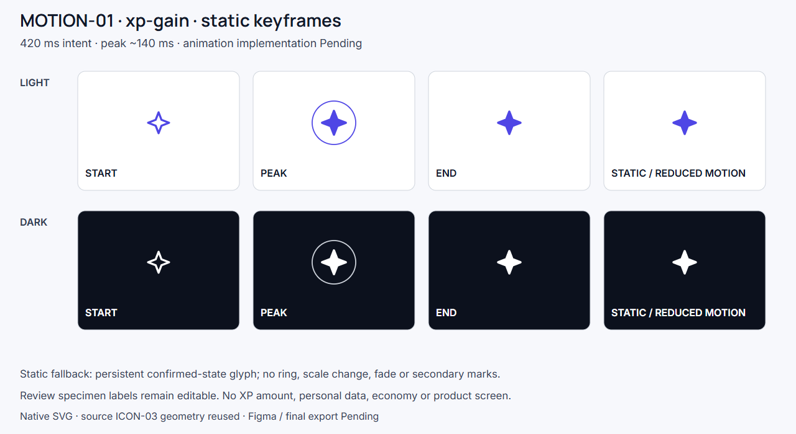
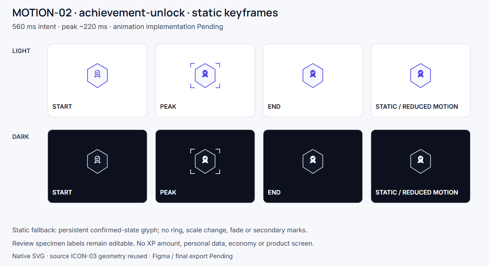
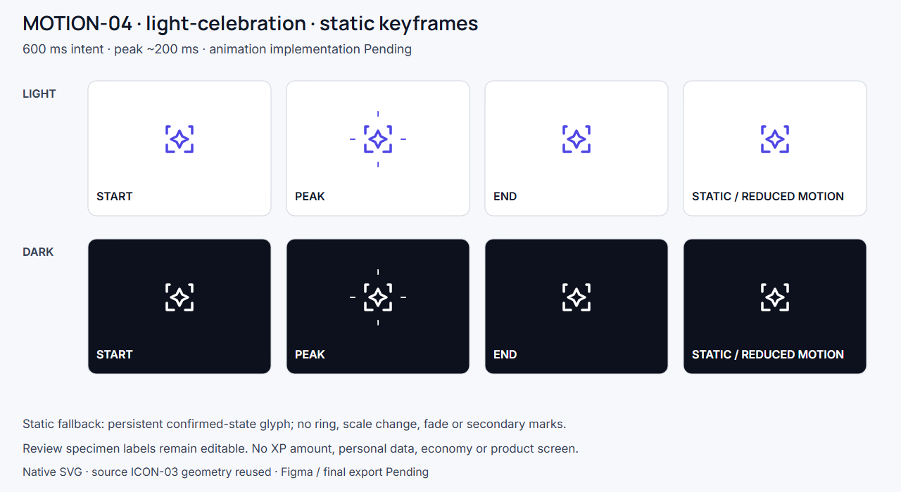
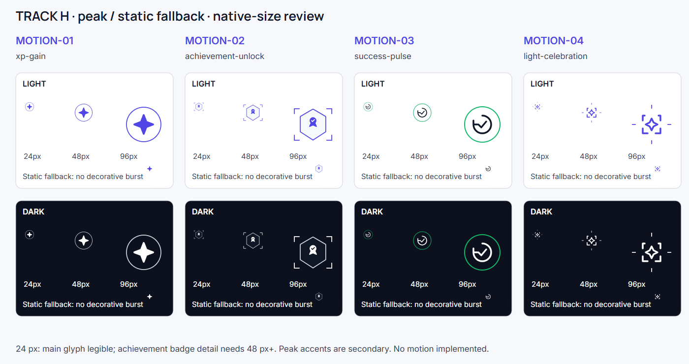

# Track H — Batch 17 / Motion Key Frames

Scope: MOTION-01 / 02 / 03 / 04 only. Status **Review**. Final Production Export **Pending**. Figma **Pending**. These are editable static design frames and motion specifications; no animation implementation or Figma component has been created.

## Delivered family

Each asset has START, PEAK, END and STATIC REDUCED-MOTION FALLBACK in actual light/dark native SVG variants: 32 individual 96×96 frames, four editable storyboards and one 24/48/96 native-size/theme diagnostic. PNG previews render the same SVG sources. No raster illustration, fake product screen, fabricated XP amount, personal data or economic mechanic appears.

| Asset | Source and visual intent | Timing / easing intent | Confirmed trigger |
|---|---|---|---|
| MOTION-01 XP Gain | Original ICON-03 XP; GAME-01 language; outline start, 1.06 peak scale with one bounded ring, settled filled glyph | ~420 ms, peak 140 ms; ease out rise, gentle standard settle | Confirmed eligible XP ledger award; not video viewing or speculative reward |
| MOTION-02 Achievement Unlock | Original ICON-03 achievement inside exact GAME-06 outer badge geometry; filled reveal, brief corner emphasis | ~560 ms, peak 220 ms; ease out, no bounce | Existing configured achievement becomes unlocked |
| MOTION-03 Success Pulse | Original ICON-03 progress-ring/check; one semantic green ring around unchanged essential glyph | ~320 ms, peak 120 ms; ease out expansion/fade | Confirmed successful local action; does not independently claim answer correctness |
| MOTION-04 Light Celebration | Original ICON-03 special-moment / GAME-10; exactly four short secondary radial strokes at peak | ~600 ms, peak 200 ms; ease out reveal, gentle exit | Confirmed existing special moment/milestone |

Timing is review intent, not new product configuration. No automatic replay, loop, flashing, oscillation, particle field or synchronized screen takeover is proposed. Approximate duration begins after the confirmed event; the acknowledgment must not delay access to the next academic action.

## Reduced motion

Every asset delivers a nonempty static fallback. It shows the final confirmed glyph directly, with no emphasis ring/corner/radial burst, no scale transition, no fade and no timed disappearance. The source fallback exists separately in both themes. It can persist with its owning acknowledgment until the user moves on. Essential meaning must also use an editable status label in actual UI assembly; future reduced-motion wiring and device testing remain Pending.

## Grammar and geometry

Approved ICON-03 SVG bodies are reused without path edits, including their 24 grid, 1.75 stroke, round caps/joins and outline/active behavior. `motion-spec.json` records each source SHA256. The achievement outer frame copies GAME-06 `M60 8 103 33v52L60 113 17 85V33Z`, scales uniformly and never morphs. K and wordmark are not present, generated or edited. Indigo remains #4F46E5; light/dark neutral fills follow the existing palette. Native theme adaptation changes color only, preserving composition and path geometry.

## QA and limits

- Native paths/rects/circles/groups throughout; no embedded images or animation elements. Labels are native SVG text using Manrope/Inter in review boards; frame sources contain no UI text.
- 24 px full-frame diagnostic preserves main glyph identity. Achievement frame/medal detail becomes too small for primary use: use 48 px+ for that composite, or the unchanged original 24 px achievement glyph in future UI. 16 px approval is not asserted.
- 48/96 px preserve badge/check/XP silhouette and restrained peak cues. Decorative rings and radial accents do not carry essential state.
- Light/dark frames are separate native sources, with essential glyphs indigo/ink on white and white on deep dark. Dark variants avoid recolored raster material.
- Success green ring on white is below 3:1. It is secondary decoration: the essential check remains dark ink with strong contrast. Do not convert that light ring into the sole status signal in implementation.
- Static fallback is visible and populated for all four assets. No reward chest, coins, casino/lootbox, neon, arcade or invented particles.
- Shared renderer verifies zero viewport text overflow. Visual inspection covers all four storyboard boards and native-size diagnostic.

`qa.json` contains measured contrast, source reuse and pending work. `manifest.json` lists actual source/preview/frame paths. `motion-spec.json` defines triggers, durations, easing and fallback behavior. `build.cjs` reproduces sources and previews.

## Review previews

Only this scoped track is authored here. Shared checklist/asset registry and serialized Git commits are owned by the coordinating agent. Batch 18/19/21 are not started.
